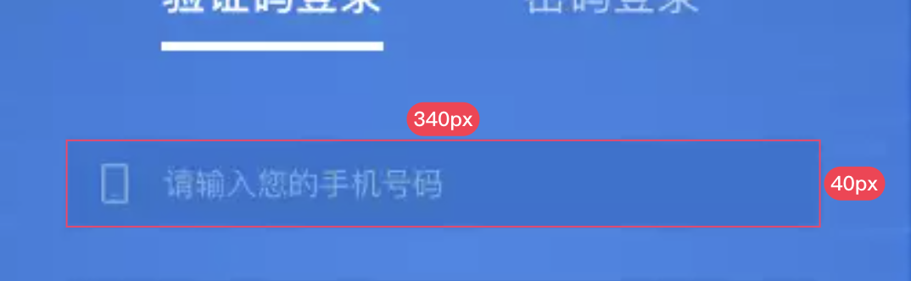
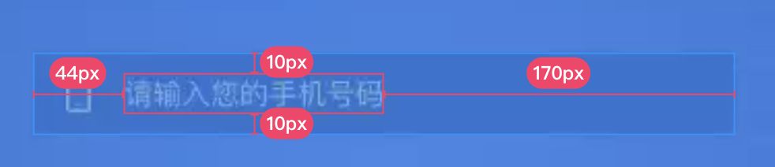
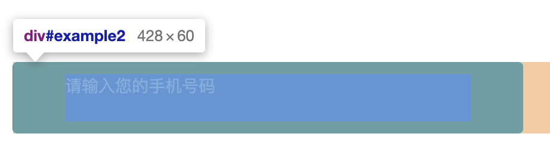

由浅入深，温故知新。纯干货。

# 基础部分

## CSS盒模型
box-sizing: content-box (浏览器默认)
box-sizing: border-box

首先要知道有两种盒模型，w3c盒模型和IE盒模型，IE是业界毒瘤所以IE盒模型又叫怪异盒模型(好吧我瞎说的)，现代浏览器默认的都是w3c标准，也就是 `content-box`，顾名思义，即`width`就是内容宽度，和边框边距相互独立，反过来 `border-box` 就是宽度包含了`padding`和`border`，相互影响。

IE盒模型也并非一无是处，某些场景下用起来也不错，举个例子：



这是一个很常见的设计图，我们先看到输入框的大小，写上对应的css：

```css
width: 340px;
height: 40px;
```



然后我们查看内容文字在其中的内边距，此时我们再设置这个内边距：

```css
padding: 10px 44px;
```

以上的操作其实都很符合直觉对吧，也是严格按照设计图要求复原元素，但是在w3c盒模型中，整个div都被撑开了：



此时只需要把它设置为IE盒模型，看，就正常了：


现在回过头再来理解IE盒模型，我们就明白了它的宽高一旦设定，除非边框边距已经超出宽高，否则宽高就是固定的，这或许符合直觉，但缺乏编程的严谨性，所以称它为“怪异”。

## BFC 块级格式化上下文

触发条件：

1. `float` 不为 none
2. `overflow` 不为 visible
3. `display` 为 inline-block、table-caption 或 table-cell
4. `position` 不为 static 或 relative

应用：

1. 阻止 margin 重叠
2. 阻止元素被浮动元素覆盖（自适应两栏布局）
3. 清除内部浮动（父级元素高度塌陷问题）

## 回流与重绘

引起元素 **大小** 或 **位置** 改变的情况，均会触发回流。反之，比如颜色样式(color、background-color、outline-style)改变，而**大小位置**不变的情况，就发生重绘 (Repaint)。

### 哪些情况会导致回流 (Reflow) 

1. 页面首次渲染
2. 浏览器窗口变化
3. 元素尺寸或位置变化（宽高、边距、边框等）
4. 元素内容发生变化（文字数量、图片大小、字体大小变化）
6. 添加删除可见的DOM节点
7. 激活css伪类（hover、active等）
8. 查询某些属性或调用某些方法（浏览器会必须回流来保证数据的准确性）

> 注意：outline-width、box-shadow、border-radius 这些属性并不会引起元素大小的改变，而是样式形状的改变，所以属于重绘。

划重点：

1. 回流必将引起重绘，重绘不一定引起回流。
2. 回流的开销比重绘更大。

进阶思考：

visibility 会引起回流还是重绘？答案是只导致重绘，因为visibility控制的元素大小位置依旧不变。同理 opacity 也是一样，但 opacity 还更加特殊一点，它是既不引起回流也不引起重绘，它触发的是css3硬件加速（GPU渲染）。

常见的触发硬件加速属性有：`transform`、`opacity`、`filters`等。

### 如何减少回流重绘

#### HTML层面

1. 避免使用table布局
2. 在DOM树最末端改变class

#### CSS层面

1. 尽量减少使用css表达式（如：calc）
2. 

#### JS层面

DOM
事件流以及事件委托机制
W3C标准如何区分捕获和冒泡，addEventListener()后面加了Boolean参数区分
```
document.body.addEventListener('click', e => {
    console.log('捕获阶段');
}, true)

document.body.addEventListener('click', e => {
    console.log('冒泡阶段');
}, false)
```

并不是所有事件都会冒泡。如注册scroll事件，就不会触发冒泡。
mouseover & mouseenter 的区别就是后者不会冒泡，假设给ul设置了mouseover事件，在鼠标经过ul时理论应该触发一次事件，但是因为ul中还有li元素，鼠标每经过一个li元素就会冒泡到ul上的mouseover，造成多次触发，所以需要在li中多处理阻止冒泡，而mouseenter就不会出现这种问题。

什么是BOM

什么是Ajax

网络请求 GET与POST区别
GET：
没有请求体，参数大小有限制
传参局限于URL编码
参数不变时，因为浏览器协调缓存原因，可能会出现304问题（解决方法请求url带随机参数）
常用于做数据拉取

POST：
有请求体，需要设置content-type，参数大小无限制
支持多种编码格式
常用于做数据提交保存


# JS基础训练

[手写call、防抖节流](https://juejin.cn/post/6972343521176977421)

[this、闭包、作用域，就用代码来理解](https://juejin.cn/post/6972716569407258661)

# JS进阶

[JS面向对象编程，原型与继承全面解析](https://juejin.cn/post/6973091550528012296)

[从零开始40行代码实现一个简单Promise函数](https://juejin.cn/post/6974942495255822344)

# Vue基础

[浅谈Vue中的12种组件通信方式及理解](https://juejin.cn/post/6971594929470603271)

[keep-alive如何销毁](https://juejin.cn/post/6976814768812195854)

# Vue进阶

[从零开始50行代码实现一个Vuex状态管理器](https://juejin.cn/post/6975355881554870285)

[探索响应式数据原理 (Proxy与Reflect)](https://juejin.cn/post/6974567194382303240)
