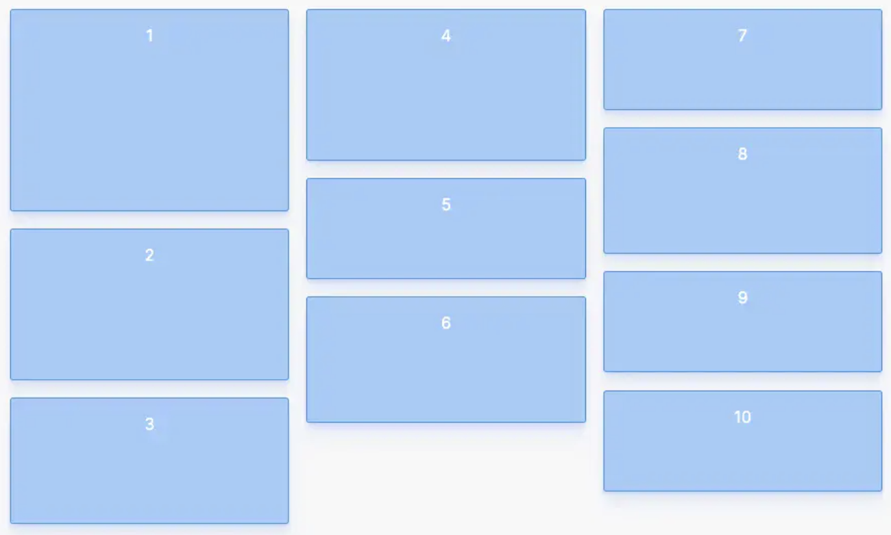
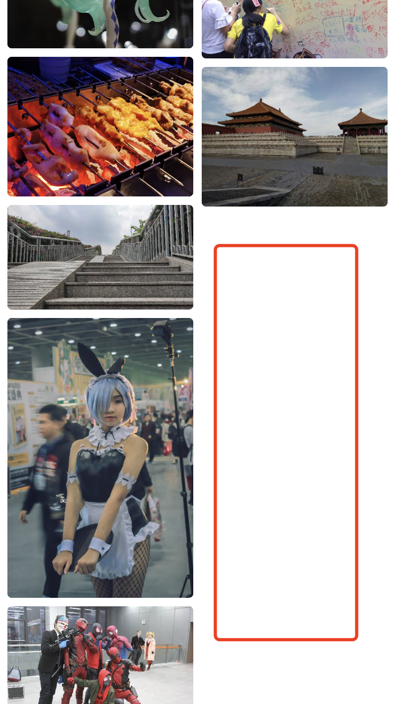
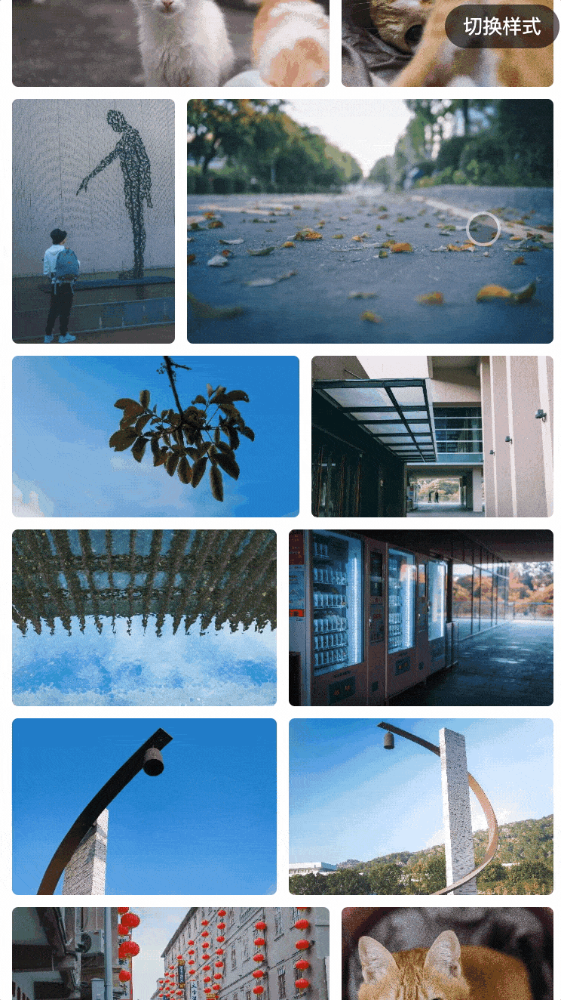
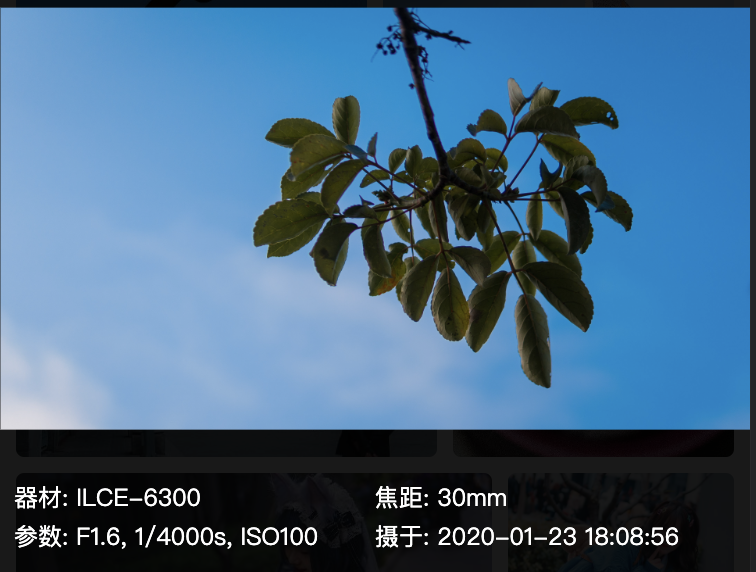
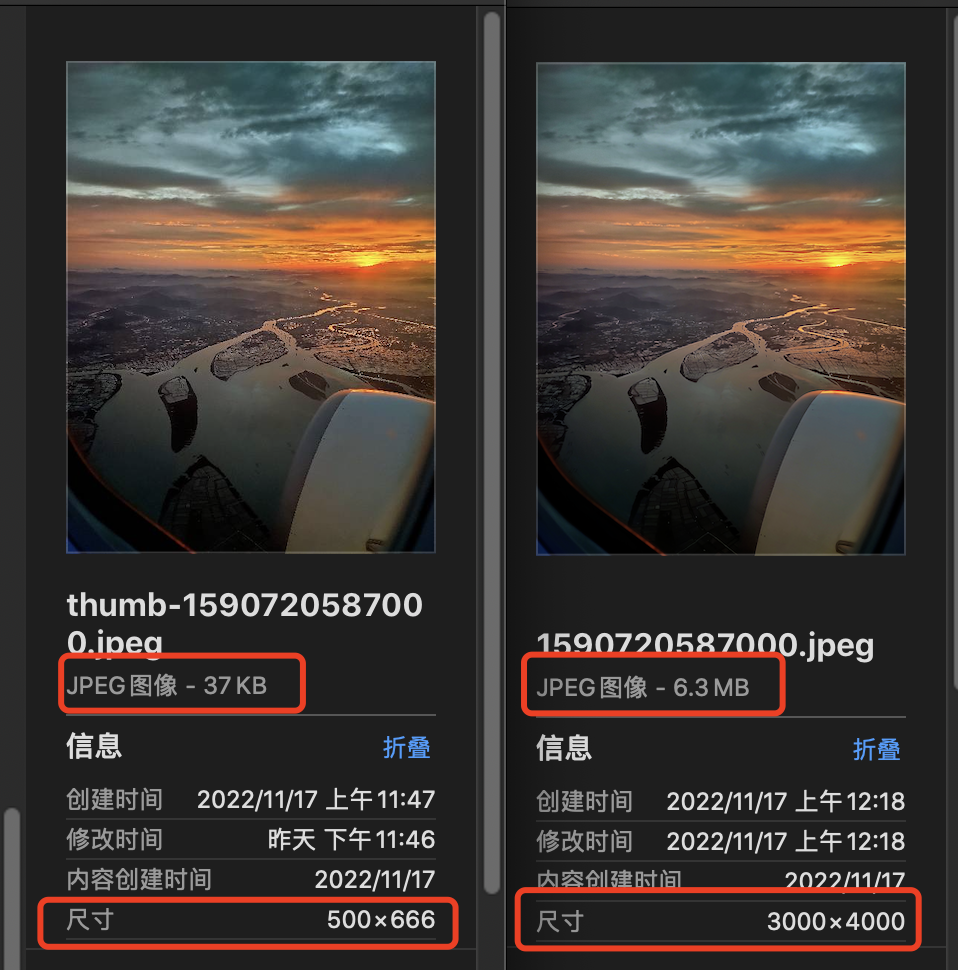
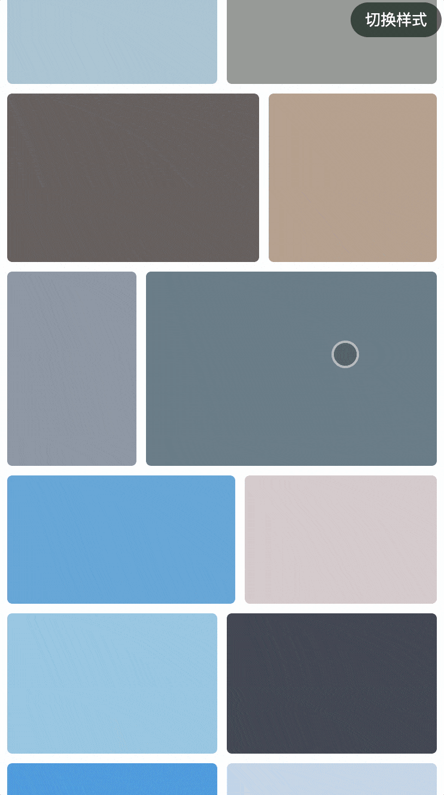
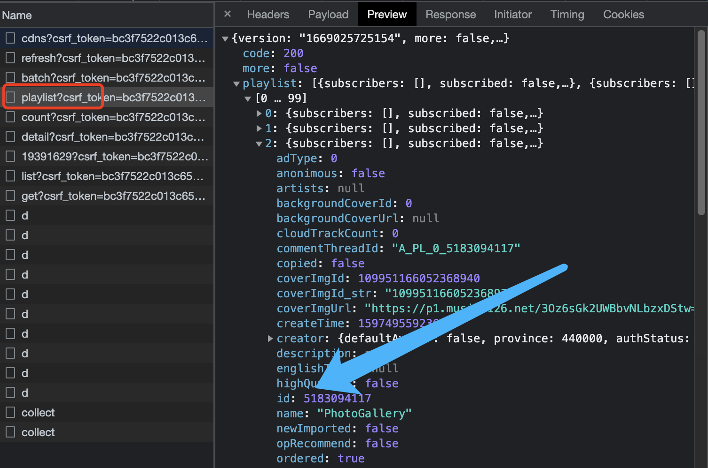

《如何三分钟将你的手机相册搬到线上，我写了这个免费在线图库生成器》
《我写了这个免费在线图库生成器，三分钟将你的手机相册搬到线上》

## 项目背景

## 如何部署

## 一点微小的工作

项目结构不复杂，根目录**view**为前端文件目录，**resources**目录为照片放置目录，我们先在**view**目录创建一个 **Vite + Vue3** 的项目，

获得图片大小，复制图片，输出json

## 瀑布流排版

瀑布流是一种经典的图片排列模式，其特点是**等宽不等高**，在保持原图比例下显示布局。

目前并没有纯**CSS**可以完美实现的瀑布流方法，常见的**多列布局**(multi-columns)实际效果非常差强人意，它会得到如下的一个竖排布局效果，在实际应用中会感觉图片是乱序排列的。



其实用**JS**实现瀑布流并不难，我们使用绝对定位布局，由于图片的宽度是平均分布的，只需要计算出图片的高度及`left`、`top`定位对应设置到图片元素上即可：

```html
<template>
    <div id="list">
        <div :style="{ position: 'absolute', width: `${img.w}px`, height: `${img.h}px`, left: `${img.left}px`, top: `${img.top}px` }" v-for="(img, i) in list" :index="i" :key="'img' + i">
          
        </div>
    </div>
</template>
```

我们用变量`columnNums`表示有多少列，`gap`表示图片间隔，容器总宽度可以由当前的**DOM**往父级查询`parentNode.offsetWidth`来获取，那么图片在布局中的宽高以及`left`值就可以计算出来了，而高度则用一个数组`columnHeights`来储存，有多少列就往里存多少个元素，随着图片列表的循环一直累加取出计算就可以得到每张图片的`top`定位了，几行代码就可以搞定：

```js
let columnNums = 2 // 有多少列
const gap = 8 // 图片之间的间隔
const columnHeights = [] // 列的高度

function waterfall(data) { // data为图片数组
  const columnHeights: any = [] // 列的高度
  let { offsetWidth: pW } = document.getElementById('list').parentNode.offsetWidth
  pW -= gap * (columnNums - 1) // 总体宽度数值等于减去间隔
  const newList = JSON.parse(JSON.stringify(data))
  for (let i = 0; i < newList.length; i++) {
    let index = i % columnNums
    const item = newList[i]
    const ratio = pW / columnNums / item.width
    item.w = pW / columnNums
    item.h = item.height * ratio
    item.left = index * (pW / columnNums + gap)
    item.top = columnHeights[index] + gap || 0
    columnHeights[index] = isNaN(columnHeights[index]) ? item.h : item.h + columnHeights[index] + gap
  }
  return newList
}
```

| 两列： | 改成三列： |
| --- | --- |
|  |  |

这时候虽然瀑布流的样式已经出来了，但拉到列表底部就会发现瘸腿了：



经过`1.024`秒的思索，我马上发现了问题所在，上面的代码仅仅只是把图片按左右的顺序依次往下排列，而每张图片高度是不一样的，这就导致出现尾部空白的现象，解决的办法也很简单，每次**找出最短的那一列**来插入图片即可，我们已经将高度都存在了`columnHeights`这个数组中，通过往`Math.min()`传入**解构数组**得到最小值，再用`indexOf`得到下标，就可以知道下一张图片该插入哪一列了，修改上面方法中的最后一行代码：

```js
function waterfall(data) { // data为图片数组
  // ...........
  // columnHeights[index] = isNaN(columnHeights[index]) ? item.h : item.h + columnHeights[index] + gap
  // TODO: 上面这行代码改为找出最短列计算高度
  if (isNaN(columnHeights[index])) {
    columnHeights[index] = item.h
  } else {
    index = columnHeights.indexOf(Math.min(...columnHeights))
    item.left = index * (pW / columnNums + gap)
    item.top = columnHeights[index] + gap || 0
    columnHeights[index] = item.h + columnHeights[index] + gap
  }
}
```

以上就是实现**瀑布流**排版的全部核心代码，可以根据实际情况进行扩展，比如通过`window.onresize`监听窗口宽度变化动态改变列数量重新排列等。

## 书架流排版

这个图片排版样式比较少见，但同样是等比例显示图片，区别于**瀑布流**的是图片**不等宽**，但同一行图片等高，所以我把它命名为**书架流**，看着是不是很像整齐排列在书架上的书本：


虽然看起来似乎是**等高不等宽**，但实际上每行高度并不都是一样的，因此我们需要一个**阈值**来决定每行高度可以被允许的上限，与瀑布流一样的是，列表整体宽度是已知的，所以核心是计算每行图片的高度，我们先来看看如何实现这个算法。

抽象问题用简单的数学问题描述往往更容易解决。假设某行存在2张图片，已知的**实际宽高**分别为`w1`、`h1`和`w2`、`h2`，而在列表中的相对宽高我们则设为`w1'`、`h1'`和`w2'`、`h2'`，接着设列表总体宽高为`W`和`H`，已知的`W`为列表父级div的宽度，我们的目的就是求这个`H`的值。

此时由于在同一行中图片**等高**，于是有：

`h1'`=`h2'`=`H`

又因为图片的比例不变，于是有：`w1'`/`h1'` = `w1`/`h1`，代入上面的式子可得：

`w1'`/`H` = `w1`/`h1`（同理得到另一个式子：`w2'`/`H` = `w2`/`h2`）

所以上面推导的两个式子可以得出图片在行内的**宽度**分别为：


而总体宽度为图片宽度相加：


代入可得到：


到这里我们已经可以轻松推导出计算高度`H`的方法了：


上面推导过程我是在纸上完成的，回到代码中，我们可以使用**递归**来操作图片数组，得到一组计算好宽高的新数组，这里我设计了一个工厂函数`factory`以及计算函数`calculate`，计算函数核心就是利用上面的公式求图片高度，而工厂函数则是用来输出每一行的图片数组，通过判断计算的高度如果超出阈值，就继续增加这一行的图片(*一个隐藏的事实是，该行图片越多高度肯定就会越小*)，如果高度在我们设置的**阈值之内**那么就将这些图片"**打包**"返回，在`handleList`函数中会拼成一个二维数组，最后**拍平**一下数组就得到我们要的数据：

```js
const gap = 8 // 图片之间的间隔
let limitWidth = document.getElementById('list').parentNode.offsetWidth // 宽度限制，列表父级div宽度
const list = JSON.parse(JSON.stringify(data)) // data为原始图片数组
const newList = await createNewArr(list)

async function createNewArr(list) {
  const standardHeight = 180 // 高度阈值
  const neatArr = [] // 整理后的数组
  function factory(cutArr) {
    return new Promise((resolve) => {
      const lineup = list.shift()
      if (!lineup) {
        resolve({ height: calculate(cutArr), list: cutArr })
        return
      }
      cutArr.push(lineup)
      const finalHeight = calculate(cutArr)
      if (finalHeight > standardHeight) { // 如果计算超出阈值，就继续加入图片
        resolve(factory(cutArr))
      } else {
        resolve({ height: finalHeight, list: cutArr })
      }
    })
  }
  function calculate(cutArr) {
    let cumulate = 0
    for (const iterator of cutArr) {
      cumulate += iterator.width / iterator.height
    }
    return (limitWidth - gap * (cutArr.length - 1)) / cumulate // 实际宽度需要减去图片间隔
  }
  async function handleList() {
    const { list: newList, height } = await factory([list.shift()])
    neatArr.push( newList.map((x) => { x.w = (x.width / x.height) * height; x.h = height; return x }))
    if (list.length > 0) {
      await handleList()
    }
  }
  await handleList()

  return neatArr.flat()
}
```

## 图片预览与查看

前面我们已经写完了图片列表的布局，接下来我们还需要点击能单独放大查看图片，并且可以支持图片**缩放**与**移动**来观察细节，实现这些操作的关键点在于 **CSS3** 中的 `transform` 变换。而实现**PC**上的点击、移动，**H5**的手势操作，则离不开DOM**事件监听**：例如鼠标移动事件对应 `mousemove`，移动端触摸移动则对应 `touchmove`，而在本项目中我们不做两套适配，将仅通过**指针事件**(`pointEvent`)进行多端**统一**的事件监听。



> 这一部分展开来讲篇幅不小，所以我又用**原生JS**实现了一遍并把完整的过程和思路都写在了这篇文章中：《[原生JS手写一个优雅的图片预览功能，带你吃透背后原理](https://juejin.cn/post/7160894692593401893)》

## 获取照片元数据

即使你使用手机拍照，并不关心照片拍摄时的设备与其它参数，你最起码也应该知道这张照片是在何时拍摄的，而且照片的**时间**也是我们排序图片的一个重要依据。前面我们用**NodeJs**读取照片源文件时，尽管通过`fs.stat`可以获取文件的创建/修改时间，但这并不能代表实际拍摄时间，此时我们就要通过 **Exif** (Exchangeable image file format) 来获得照片中记录的数据。

> 照片如果经过一些美图app的处理，元数据会被抹掉，在PS、LR等专业修图软件中导出成片时，也别忘了勾选保留照片元数据，另外微信传图(即使选择原图)也会丢失元数据，这类软件是出于保护隐私考虑。

在网页项目中我们可以直接引入`exif.js`读取照片元数据，不过在本项目中，图片会先经过一个处理阶段，所以我们直接在**Node**中解析好数据：

安装一下 `exif` 这个库：`npm install exif`

```js
const ExifImage = require('exif').ExifImage
new ExifImage({ image: filedir }, async function (error, exifData) {
  if (!error) {
    const { ImageWidth: width, ImageHeight: height, ModifyDate } = exifData.image // 获取到图片一些数据
    let datetime = exifData.exif.DateTimeOriginal || ModifyDate // 元数据
    // TODO: 解析出来的格式不标准，转化成我们可以使用的：
    datetime && (result.datetime = datetime.split(' ')[0].replace(/:/g, '-') + ' ' + datetime.split(' ')[1].slice(0, 8))
    if (JSON.stringify(exifData.gps) === '{}') {
      // 定位属于隐私信息
    }
  }
})
```

这一步没太多好讲的，利用插件解析出来整理好需要的数据就可以了，只需要注意不要丢失照片文件的原始数据否则读取不到。



## Node图片解码

在网页中通常我们可以利用**HTML5**提供的**Canvas**来获得解码图片的能力，但在**NodeJs**环境中使用**Canvas**会比较麻烦，所以这里推荐 [images](https://www.npmjs.com/package/images) 这个Node轻量级编解码库，处理图片的速度还是蛮快的，不过我在 MacOX 中安装最新版本会报错，只能锁定`3.2.3`这个版本(如果你的网络情况不好导致安装失败，推荐使用 **pnpm** 安装)

为什么要解码图片呢？如果你经常接触移动端H5开发，应该碰到过**图像翻转问题**，因为手机照片通常会以原始的**拍摄方向**展示，可能你在手机上看着没什么问题，但是直接链接到网页上显示就会发现图像翻转了，所以我们需要手动**翻转图像**到正确位置并重新编码图像。

回到我们的项目中，配合 [image-size](https://www.npmjs.com/package/image-size) 这个库可以快速获得照片的方向值，判断如果方向偏移，那么直接使用 **images** 这个库**编码保存**，图像会自动翻转到正确方向。

```js
const sizeOf = require('image-size')
const images = require('images')

const filedir = '' // <- 图像地址
const dimensions = sizeOf(filedir)
if ([6, 8, 3].includes(dimensions.orientation)) {
  // TODO：通过解码写入来复制图片，判断方向是否正确。
  images(filedir).save(.......) // 写入到新的地址
}
```

通过 **images** 重新编码的照片，元数据会被抹除，所以我们也可以配合前面 **exif** 检查照片如果存在 **GPS** 对象，就不直接复制照片而是重新编码照片以此消除隐私信息，当然相对的处理速度就会变慢。

## Node生成缩略图

照片原始图像并不小，如果直接显示在列表中肯定是不行的，所以我们要在列表中显示缩略图，在实际点击某张图片时再请求原始图。

通过上面的图片编解码库，我们也可以方便地生成缩略图了：

```js
// filedir: 图像地址，thumbSize: 压缩后图像宽度，quality: 压缩质量
images(filedir).size(thumbSize).save(.....), { quality: 70 })
```

以压缩到目标宽度500，质量70%为例，可以看到压缩率还是不错的：



## 生成预载占位颜色

尽管我们有了缩略图，加载图片列表速度大大提升了，但请求到显示图片一样需要时间，为了避免加载完成前的白屏，我们还可以用颜色来充当占位，保证**DOM**结构渲染完立即正常显示页面。

我们简单编写一个组件来取代 **img** 标签显示图片，当图片未加载完成时则显示一个颜色，注意这里的 **img** 不能用`if`隐藏，应该让它存在**DOM**当中，否则`onLoad`回调不会触发：

```html
<template>
  <div class="img">
    
    <div v-if="loading" class="color" :style="{ background: data.color }" />
  </div>
</template>

<script lang="ts">
import { defineComponent, ref, watch } from 'vue'

export default defineComponent({
  props: {
    src: {},
    data: {},
  },
  setup(props) {
    const loading = ref(true)
    const loadDone = () => {
      loading.value = false
    }
    watch(() => props.src, () => {
        loading.value = true
    })
    return { loading, loadDone }
  },
})
</script>

<style scoped>
  .img {
    position: relative;
    overflow: hidden;
    width: 100%;
    height: 100%;
  }
  .img > img {
    display: block;
    width: 100%;
    height: 100%;
  }
  .color {
    width: 100%;
    height: 100%;
    border-radius: 4px;
    animation: breathe 600ms ease-out infinite alternate;
  }
  /* 呼吸效果 */
  @keyframes breathe {
    0% { opacity: 0.8 }
    100% { opacity: 1 }
  }
</style>
```


如果随机生成个颜色占位，就显得太不专业了，我们可以用 [colorthief](https://www.npmjs.com/package/colorthief) 这个库来提取图片的主题色：

```js
const ColorThief = require('colorthief')

ColorThief.getColor(image, quality).then((color) => {
    rgbToHex(color) // color 为图片主颜色，格式为三原色数组
}).catch((err) => {})
```

> 参数解释：
> 
> `image`: 在Node中运行时，这个参数为图像的路径。
>
> `quality`: 是一个可选参数，必须是值为1或更大的Integer，默认值为10。这个数字决定了在下一个采样之前跳过多少像素。数值越大，返回值的速度越快。

得到的颜色为数组(代表RGB三原色)，我们可以转换成16进制颜色：

```js
const rgbToHex = (rgb) => '#' + rgb.map((x) => {
  const hex = x.toString(16)
  return hex.length === 1 ? '0' + hex : hex
}).join('')
```

实际使用的过程中发现，在**NodeJs**中不仅处理速度非常慢，还容易因为内存不足等问题发生崩溃，打开 **colorthief** 的包发现，其依赖的是 [get-pixels](https://www.npmjs.com/package/get-pixels) 这个库解码图像，这是一个纯 **JavaScript** 实现的库，性能非常低，所以我这里没有直接使用原图来提取主题色，而是使用了前面我们用 **images** 解码图像生成的**缩略图**来作为提取颜色的图片，这样就保证了速度与稳定性。

## 懒加载

图片的加载到目前已经很流畅，但由于我们一进来就渲染了全部图片，这样图片太多时体验肯定会变差，作为一个有追求的页面仔，我们当然希望的是用户滑动/滚动到哪里，哪里才会显示图片，也就是常说的**懒加载**，那么如何实现呢？通常我们会想到利用页面**滚动事件**监听，上面写列表样式时我们已经可以得到图片的大小和位置，结合`scrollTop`与浏览器**窗口高度**就不难判断图片是否在当前窗口中了，利用这个原理我还可以实现滚动时变换时间的效果：


但是这里图片**懒加载**我使用另一种方式实现：[Intersection Observer](https://developer.mozilla.org/zh-CN/docs/Web/API/IntersectionObserver)，这是一个浏览器原生API，可以用于异步观察目标元素与其祖先元素或顶级文档视窗是否**交叉**的方法，简单讲就是可以监听一个元素是否出现在视窗当中，就这么简单粗暴，该API其实已经提出很久了，所以不用太担心兼容性问题。

```js
onMounted(async () => {
  await nextTick()
  observer()
})

function observer() {
  const observer = new IntersectionObserver((entries) => {
    entries.forEach((item) => {
      if (item.isIntersecting) {
        // TODO: 换上真实的图片链接
        observer.unobserve(item.target) // 停止监听该节点
      }
    })
  }) //不传options参数，默认根元素为浏览器视口
  document.querySelectorAll('.img-box').forEach((div) => observer.observe(div)) // 遍历监听所有图片DOM节点
}
```



## 来点音乐

只有图片太单调，来点音乐吧~进入[网易云网页版](https://music.163.com/#/my/)，登录后打开控制台，点击进入“我的音乐”中，此时找到`playlist`这个接口，就可以看到你的歌单啦，找到你喜欢的歌单`id`，等下就把它搬到我们的在线相册当中。



接下来我们使用 [NeteaseCloudMusicApi](https://github.com/Binaryify/NeteaseCloudMusicApi) 这个库，它利用**CSRF**伪造请求头来调用网易云官方API，通过它我们可以轻松获取到歌单数据以及播放音乐的链接了，虽然它需要部署在服务端，但是没关系，作者提供了 **Vercel** 部署的配置，仓库里的`README.MD`文件有详细部署说明，这里就不过多赘述了，总之 **Vercel** 是国外一个部署前端应用的云平台，我们把**node**项目部署上去就可以直接使用了。

```js
// api.js
import fetch from '@/utils/axios'
// 文档地址：https://binaryify.github.io/NeteaseCloudMusicApi/#/
// 获取歌曲播放链接
export const getUrl = (params: Type.Object = {}) => fetch(MUSIC_URL + '/song/url', params, 'get')
// 通过 id 获取歌单详情
export const getList = (params: Type.Object = {}) => fetch(MUSIC_URL + '/playlist/detail?id=5183094117', params, 'get')
```

> **Vercel** 网址在国内被墙不能直接访问，不过我们可以通过配置**CNAME**解决，如果你有自己的域名可以**fork**一下玩玩，没有也没关系，本项目已经配置好了我的域名，不过稳定性不敢保证~

为了方便与美观，我们直接使用 [APlayer](https://github.com/DIYgod/APlayer) 作为播放器界面，由于不是必要插件，所以我通过**JS动态引入**来使用，就不通过npm安装了。

```js
// deferLoader.js 异步加载脚本方法
export default (type, url) => {
  return new Promise((resolve) => {
    const link_element = document.createElement(type)
    if (type === 'script') {
      link_element.setAttribute('src', url)
    } else if (type === 'link') {
      link_element.setAttribute('rel', 'stylesheet')
      link_element.setAttribute('href', url)
    }
    document.head.appendChild(link_element)
    link_element.onload = function () {
      resolve()
    }
  })
}
```

这个组件很简单，调用接口，通过 `id` 获取歌单详情，然后通过歌单中的歌曲id获取到歌曲播放地址的`url`，不过需要注意，由于我们的宗旨是搭建免费网站，缺少服务端，此方式因为没有登录状态，获取到的歌单曲目只会显示 **10** 首，但是也够用了（总不能把网易云账号密码写进前端项目里吧）

```html
<template>
  <div id="aplayer"></div>
</template>

<script>
import { defineComponent, onMounted, nextTick } from 'vue'
import * as api from './api'
import loader from '@/utils/widgets/deferLoader'

export default defineComponent({
  setup() {
    onMounted(async () => {
      const ids = []
      const listObj = {}
      const { data: resList } = await api.getList()

      for (const x of resList.playlist.tracks) {
        ids.push(x.id)
        listObj[x.id] = { name: x.name, artist: x.ar[0] ? x.ar[0].name : '', cover: x.al.picUrl }
      }
      let { data: audio } = await api.getUrl({ id: ids + '', realIP: '116.25.146.177' }) // ip是随便填的，不填会无法访问接口
      audio = audio.data.map((x: any) => {
        return Object.assign({ url: x.url }, listObj[x.id])
      })
     // 启动播放器
     await load()
     await nextTick()
     const APlayer = window.APlayer
        new APlayer({
          container: document.getElementById('aplayer'),
          fixed: true, // 播放器会吸附在底部，可能项目比较老iphone黑边没有处理，所以下面补上了样式
          autoplay: true,
          audio,
        })
    })
    async function load() {
      await loader('script', 'https://cdn.jsdelivr.net/npm/aplayer@1.10.1/dist/APlayer.min.js')
      await loader('link', 'https://cdn.jsdelivr.net/npm/aplayer@1.10.1/dist/APlayer.min.css')
    }
  },
})
</script>

<style>
  .aplayer.aplayer-fixed .aplayer-body {
    bottom: calc(constant(safe-area-inset-bottom));
    bottom: calc(env(safe-area-inset-bottom));
  }
</style>
```

效果大概就是这样，非常**朴实无华**：


你在打码的时候又喜欢听些什么歌呢？

## 结尾


