《你还在找图片预览插件吗？不如自己写一个吧！》

## 前言

本文将详细讲解前端**图片预览**背后的原理，带大家用原生JS手写一个完整的图片预览和查看的功能，无任何第三方依赖，兼容PC与H5，实现触屏双指缩放等，干货满满。

> 注：为了提升阅读体验，正文中大部分代码均有省略处理，**完整代码可以在文末查看**。

## 实现原理

实现图片预览/查看的关键在于 **CSS3** 中的 `transform` 变换，该属性应用于元素在2D或3D上的旋转，缩放，移动，倾斜等等变换，通过设置 `translate(x,y)` 即可偏移元素位置，设置`scale`即可缩放元素，当然你也可以只设置 `matrix` 来完成上述所有操作，这涉及到矩阵变换的知识，本文使用的均是CSS提供的语法糖进行变换操作。

PC上的点击、移动，H5的手势操作，都离不开DOM**事件监听**。例如鼠标移动事件对应 `mousemove`，移动端因为没有鼠标则对应 `touchmove`，而本文将介绍如何仅通过**指针事件**来进行多端**统一**的事件监听。在监听事件中我们可以通过 `event` 对象获取各种属性，例如常用的 `offsetX`、`offsetY` 相对偏移量，`clientX`、`clientY` 距离窗口的横坐标和纵坐标等。

除此之外可能还需要具备一点数学基础，如果像我这样数学知识几乎都还给了高中老师的话可以复习下向量的加减计算。

## 打开蒙层

在开始前我们先准备一个图片列表，并绑定好点击事件，当点击图片时，通过 `document.createElement` 创建元素，然后把图片节点**克隆**进蒙层中，这对你来说并不难，简单实现如下。

```html
<div id="list">
    
    ............
</div>
```

```css
/* 图片预览样式 */
.modal {
  touch-action: none;
  user-select: none;
  position: fixed;
  top: 0;
  left: 0;
  width: 100vw;
  height: 100vh;
  background-color: rgba(0, 0, 0, 0.75);
}
.modal > img {
  position: absolute;
  padding: 0;
  margin: 0;
  transform: translateZ(0);
}
```

```js
let cloneEl = null
let originalEl = null
document.getElementById('list').addEventListener('click', function (e) {
  e.preventDefault()
  if (e.target.classList.contains('item')) {
    originalEl = e.target // 缓存原始图DOM节点
    cloneEl = originalEl.cloneNode(true) // 克隆图片
    originalEl.style.opacity = 0
    openPreview() // 打开预览
  }
})

function openPreview() {
  // 创建蒙层
  const mask = document.createElement('div')
  mask.classList.add('modal')
  // 添加在body下
  document.body.appendChild(mask)
  // 注册蒙层的点击事件，关闭弹窗
  const clickFunc = function () {
    document.body.removeChild(this)
    originalEl.style.opacity = 1
    mask.removeEventListener('click', clickFunc)
  }
  mask.addEventListener("click", clickFunc)
  mask.appendChild(cloneEl) // 添加图片
}

// 仅用于修改样式的工具类，减少回流重绘
function changeStyle(el, arr) {
  const original = el.style.cssText.split(';')
  original.pop()
  el.style.cssText = original.concat(arr).join(';') + ';'
}
```

这时候我们成功添加一个**打开预览**的蒙层效果了，但克隆出来的图片位置是没有指定的，此时需要用 `getBoundingClientRect()` 方法获取一下元素相对于**可视窗口**的距离，设置为图片的**起始位置**，覆盖在原图片的位置之上，以取代文档流中的图片。

```js
// ......
// 添加图片
const { top, left } = originalEl.getBoundingClientRect()
changeStyle(cloneEl, [`left: ${left}px`, `top: ${top}px`])
mask.appendChild(cloneEl)
```

效果如下，看起来像点击高亮图片的感觉：

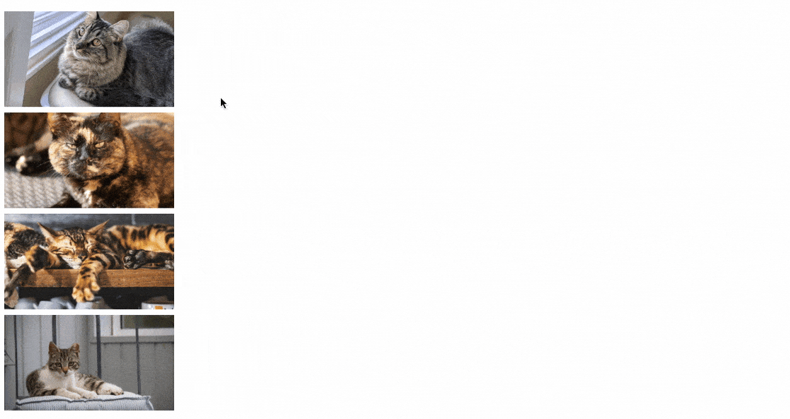

接下来我们需要实现焦点放大的效果，简单来说就是计算两点之间的位移距离作为 `translate` 偏移量，将图片偏移到**屏幕中心点**位置，然后缩放一定的比例来达到查看效果，通过 `transition` 实现过渡动画。

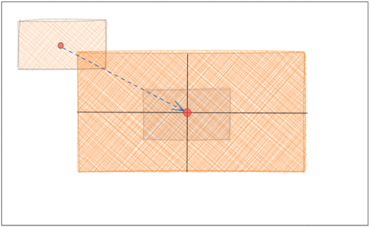

中心点位置我们可以通过 `window` 下的 `innerWidth` 和 `innerHeight` 来获取浏览器**可视区域**宽高，然后除以2即可得到中心点坐标。

```js
const { innerWidth: winWidth, innerHeight: winHeight } = window

// 计算自适应屏幕的缩放值
function adaptScale() {
  const { offsetWidth: w, offsetHeight: h } = originalEl // 获取文档中图片的宽高
  let scale = 0
  scale = winWidth / w
  if (h * scale > winHeight - 80) {
    scale = (winHeight - 80) / h
  }
  return scale
}

// 移动图片到屏幕中心位置
  const originalCenterPoint = { x: offsetWidth / 2 + left, y: offsetHeight / 2 + top }
  const winCenterPoint = { x: winWidth / 2, y: winHeight / 2 }
  const offsetDistance = { left: winCenterPoint.x - originalCenterPoint.x + left, top: winCenterPoint.y - originalCenterPoint.y + top }
  const diffs = { left: ((adaptScale() - 1) * offsetWidth) / 2, top: ((adaptScale() - 1) * offsetHeight) / 2 }
  changeStyle(cloneEl, ['transition: all 0.3s', `width: ${offsetWidth * adaptScale() + 'px'}`, `transform: translate(${offsetDistance.left - left - diffs.left}px, ${offsetDistance.top - top - diffs.top}px)`])
  // 动画结束后消除定位重置的偏差
  setTimeout(() => {
    changeStyle(cloneEl, ['transition: all 0s', `left: 0`, `top: 0`, `transform: translate(${offsetDistance.left - diffs.left}px, ${offsetDistance.top - diffs.top}px)`])
    offset = { left: offsetDistance.left - diffs.left, top: offsetDistance.top - diffs.top } // 记录值
  }, 300)
```

这里先利用绝对定位 `left` `top` 来设置克隆元素的初始位置，再通过 `translate` 偏移位置，是为了更自然地实现动画效果，动画结束后再将绝对定位的数值归零并把偏移量加进 `translate` 中，并且这里我并没有直接使用 `scale` 放大元素，而是将比例转化为**宽高**的变化。最终效果如下：


## 图片缩放（PC）

在PC实现图片缩放相对是比较简单的，我们利用**滚轮事件**监听并改变 `scale` 值即可。重点是利用 `deltaY` 值的正负来判断滚轮是朝上还是朝下：

```js
let origin = 'center'
let scale = 1
// 注册事件
mask.addEventListener('mousewheel', zoom, { passive: false })

// 滚轮缩放
const zoom = (event) => {
  if (!event.deltaY) {
    return
  }
  event.preventDefault()
  origin = `${event.offsetX}px ${event.offsetY}px`
  
  if (event.deltaY < 0) {
    scale += 0.1 // 放大
  } else if (event.deltaY > 0) {
    scale >= 0.2 && (scale -= 0.1) // 缩小
  }
  changeStyle(cloneEl, ['transition: all .15s', `transform-origin: ${origin}`, `transform: translate(${offset.left + 'px'}, ${offset.top + 'px'}) scale(${scale})`])
}
```

因为缩放始终都以**图片中心**为原点进行缩放，这显然不符合我们的操作习惯，所以在上面的代码中，我们通过鼠标**当前的偏移量**即 `offsetX、offsetY` 的值改变 `transform-origin` 来动态设置缩放的原点，效果如下：

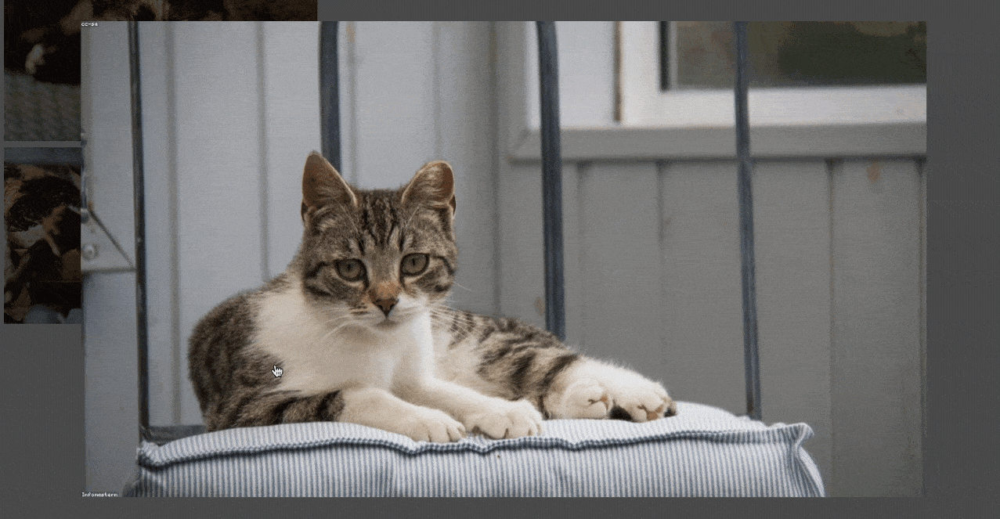

> 乍一看好像没什么问题，事实上如果鼠标不断移动且幅度很大时会出现抖动，需要消除**原点位置突然改变**带来的影响才能完全解决这个问题（期初我并未发现，后面在做移动端缩放时简直是灾难级体验）而由于PC上问题并不明显，这里先按下不表，后面会详细提到。

## 移动查看

由于缩放导致图像发生变化，我们自然地想到要靠移动来观察图片，此时体现在PC端的是按住鼠标**拖拽**，移动端则是手指**点击滑动**，而两者各自的**事件监听**显然并不共通，如以**移动事件**为例，PC端对应的是 `mousemove` 事件而移动端则是 `touchmove` 事件，这就意味着如果我们要做到兼容多端，就必须注册多个事件监听。

那么有没有一种事件可以做到同时监听**鼠标操作**和**手指操作**呢？答案是有的！那就是 **指针事件**（Pointer events），它被设计出来就是为了便于提供更加一致与良好的体验，无需关心不同用户和场景在**输入硬件上的差异**。接下来我们就以此事件为基础来完成各项操作功能。

> **指针** 是输入设备的硬件层抽象（比如鼠标，触摸笔，或触摸屏上的一个触摸点），它能指向一个具体表面（如屏幕）上的一个（或一组）坐标，可以表示包括接触点的位置，引发事件的设备类型，接触表面受到的压力等。
> 
> [`PointerEvent`](https://developer.mozilla.org/zh-CN/docs/Web/API/PointerEvent) 接口继承了所有 [`MouseEvent`](https://developer.mozilla.org/zh-CN/docs/Web/API/MouseEvent "MouseEvent") 中的属性，以保障原有为鼠标事件所开发的内容能更加有效的迁移到指针事件。

移动图片的实现是比较简单的，在每次**指针按下**时我们记录 `clientX`、`clientY` 为初始值，**移动时**计算当前的值与初始点位的**差值**加到 `translate` 偏移量中即可。需要注意的是每次移动事件结束时都必须**更新初始点位**，否则膨胀的偏移距离会使图片加速逃逸可视区域。另外当**抬起**动作结束时，会触发 `click` 事件，所以注意加入全局变量标记以及定时器进行一些判断处理。

```js
let startPoint = { x: 0, y: 0 } // 记录初始触摸点位
let isTouching = false // 标记是否正在移动
let isMove = false // 正在移动中，与点击做区别

// 鼠标/手指按下
window.addEventListener('pointerdown', function (e) {
  e.preventDefault()
  isTouching = true
  startPoint = { x: e.clientX, y: e.clientY }
})
// 鼠标/手指抬起
window.addEventListener('pointerup', function (e) {
  isTouching = false
  setTimeout(() => {
    isMove = false
  }, 300);
})
// 鼠标/手指移动
window.addEventListener('pointermove', (e) => {
  if (isTouching) {
    isMove = true
    // 单指滑动/鼠标移动
    offset = {
      left: offset.left + (e.clientX - startPoint.x),
      top: offset.top + (e.clientY - startPoint.y),
    }
    changeStyle(cloneEl, [`transform: translate(${offset.left + 'px'}, ${offset.top + 'px'}) scale(${scale})`, `transform-origin: ${origin}`])
    // 注意移动完也要更新初始点位，否则图片会加速逃逸可视区域
    startPoint = { x: e.clientX, y: e.clientY }
  }
})
```

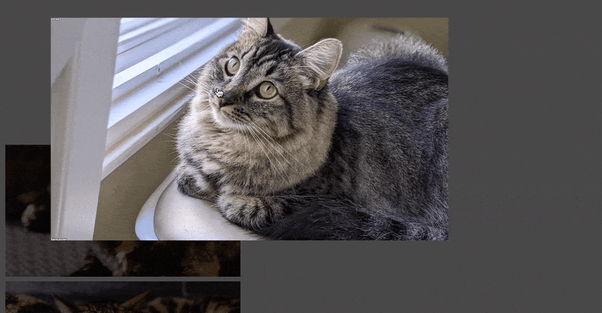

## 双指缩放（移动端）

在 `TouchEvent` 的事件对象中，我们可以找到 `touches` 这个数组，在移动端通常都是利用这个数组来**判断触点个数**的，例如 `touches.length > 1` 即是多点操作，这是我们实现**双指缩放**的基础。但在 **指针事件** 中却找不到类似的对象（*MDN对其描述只是扩展了 `MouseEvent` 的接口*），想来 `Touch` 对象只服务于 `TouchEvent` 这点其实也可以理解，所以要自己实现对**触摸点数**的记录。

这里我们使用 `Map` 数组对触摸点进行记录（*通过这个实例你可以看到 `Map` 数组纯 `api` 操作增删改有多么优雅*）。其中我们利用 `pointerId` 标识触摸点，移动事件中根据事件对象的 `pointerId` 来更新对应触点（*指针*）的数据，当触点抬起时则从`Map`中删除点位：

```js
let touches = new Map() // 触摸点数组

window.addEventListener('pointerdown', function (e) {
  e.preventDefault()
  touches.set(e.pointerId, e) // TODO: 点击存入触摸点
  isTouching = true
  startPoint = { x: e.clientX, y: e.clientY }
  if (touches.size === 2) { 
        // TODO: 判断双指触摸，并立即记录初始数据
  }
})

window.addEventListener('pointerup', function (e) {
  touches.delete(e.pointerId) // TODO: 抬起时移除触摸点
  // .....
})

window.addEventListener('pointermove', (e) => {
  if (isTouching) {
    isMove = true
    if (touches.size < 2) {
      // TODO: 单指滑动，或鼠标拖拽
    } else {
      // TODO: 双指缩放
      touches.set(e.pointerId, e) // 更新点位数据
      // .......
    }
  }
})
```

> `Map` 是二维数组，可以利用 `Array.from` 转成普通数组即可通过 `index` 下标取值。

简单在手机浏览器上测试后发现，这个数组偶尔会**不停增加**（例如在滑动页面时），也就是 `pointerup` 会出现不能正确删除对应点位的情况，或者说被意外中断了，此时会触发 `pointercancel` 事件监听(对应 `touchcancel` 事件)，我们必须在这里清空数组，这是容易被忽略的一点，原本 `TouchEvent` 中的 `touches` 并不需要处理。

```js
window.addEventListener('pointercancel', function (e) {
  touches.clear() // 可能存在特定事件导致中断，所以需要清空
})
```

现在我们有了对**触摸点判断**的基础，就可以开始实现**缩放**了，当双指接触屏幕时，记录**两点间距离**作为初始值，当双指在屏幕上捏合，**两点间距**不停发生变化，此时存在一个变化**比例** = `当前距离 / 初始距离`，该比例作为改变 `scale` 的系数就能得到新的缩放值。

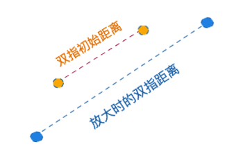

> 在上一篇文章[手写拖拽效果](https://juejin.cn/post/7145447742515445791#heading-5)中我也讲到了如何在**JS**中使用数学方法**计算两点间距离**，下面介绍另一种常见的简洁写法，`Math.hypot()` 函数返回其参数的平方和的平方根：
> 
> 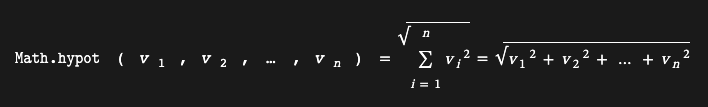
> 
> ```js
> // 坐标点1: start，坐标点2: end，求两点距离：
> Math.hypot(end.x - start.x, end.y - start.y)
> // 所以为什么上面代码可以计算两点距离，因为等价于：
> Math.sqrt(Math.pow(end.x - start.x, 2) + Math.pow(end.y - start.y, 2))
> ```

回到代码中，直接取出 `touches` 的前两个点位，于两点间获取距离：

```js
// 获取距离
function getDistance() {
  const touchArr = Array.from(touches)
  if (touchArr.length < 2) {
    return 0
  }
  const start = touchArr[0][1]
  const end = touchArr[1][1]
  return Math.hypot(end.x - start.x, end.y - start.y)
}
```

继续完善上面的代码：

```js
let touches = new Map() // 触摸点数组
let lastDistance = 0 // 记录最后的双指初始距离
let lastScale = 1 // 记录下最后的缩放值

window.addEventListener('pointerdown', function (e) {
  // .........
  if (touches.size === 2) { // TODO: 判断双指触摸，并立即记录初始数据
    lastDistance = getDistance()
    lastScale = scale // 把当前的缩放值存起来
  }
})

window.addEventListener('pointerup', function (e) {
// .........
  if (touches.size <= 0) {
    // .........
  } else {
    const touchArr = Array.from(touches)
    // 双指如果抬起了一个，可能还有单指停留在触屏上继续滑动，所以更新点位
    startPoint = { x: touchArr[0][1].clientX, y: touchArr[0][1].clientY }
  }
  // .......
})

window.addEventListener('pointermove', (e) => {
  e.preventDefault()
  if (isTouching) {
    isMove = true
    if (touches.size < 2) { // 单指滑动
      // .......
    } else {
      // 双指缩放
      touches.set(e.pointerId, e)
      const ratio = getDistance() / lastDistance // 比较距离得出比例
      scale = ratio * lastScale // 修改新的缩放值
      changeStyle(cloneEl, ['transition: all 0s', `transform: translate(${offset.left + 'px'}, ${offset.top + 'px'}) scale(${scale})`, `transform-origin: ${origin}`])
    }
  }
})
```

以上仅是实现了缩放的处理，而**缩放原点**还在默认的图片中心，就和PC端一样我们还要改变原点才显得自然，对于双指缩放来说，改变的只是两点间距离，无论双指间距如何改变，两点连成的**线段中心点**是不会变的，所以我们只要通过两点求出**中心点坐标**设置为原点坐标即可：

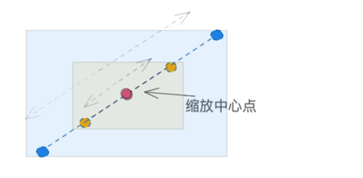

```js
window.addEventListener('pointermove', (e) => {
  // .......
      // 双指缩放
      const ratio = getDistance() / lastDistance // 比较距离得出比例
      scale = ratio * lastScale // 修改新的缩放值    
      const touchArr = Array.from(touches)
      const start = touchArr[0][1]
      const end = touchArr[1][1]
      x = (start.offsetX + end.offsetX) / 2
      y = (start.offsetY + end.offsetY) / 2
      origin = `${x}px ${y}px`
      changeStyle(cloneEl, ['transition: all 0s', `transform: translate(${offset.left + 'px'}, ${offset.top + 'px'}) scale(${scale})`, `transform-origin: ${origin}`])
  // ........
})
```

这时缩放感觉是没有问题了，但是每当往屏幕中的不同位置再多进行几次操作时，图片会突然间闪动一下位置，到最后几乎不受控制。

这就回到前面提到的，**原点位置突然改变**带来的偏移量引起了图片位置的突然闪动，那么这段偏移是如何产生的呢，我们画两张图看下，在原点变化的前后图像的坐标点发生了哪些变化：

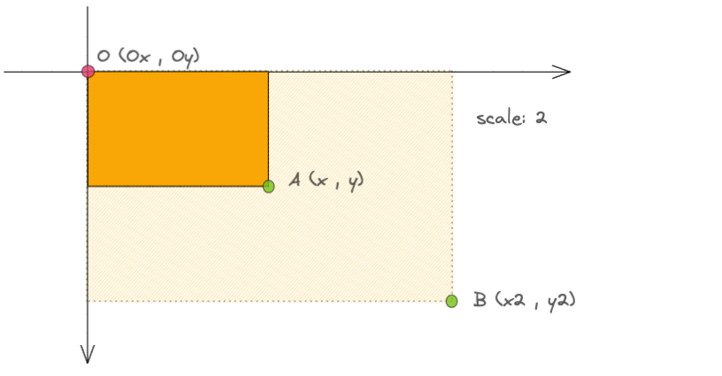

如上图，原点为 **O** 时，我们取右下角的点设为点 **A**，图像放大2倍时 **A** 点变换到 **B** 点。

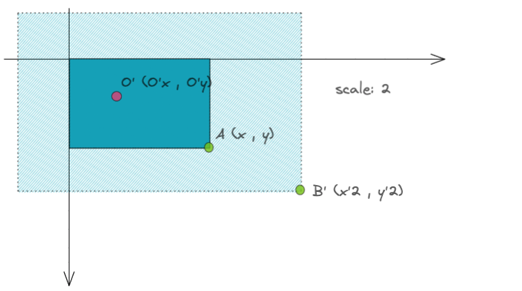

而当原点突然变为 **O’** 时，点 **A** 在图像放大2倍时则变换到了 **B'** 点。

我们可以把**图像的偏移**抽象为图像某个**点位的偏移**，这样问题就变成了计算 **BB'** 的距离：

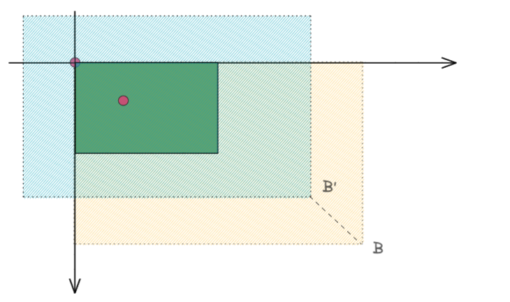

设原点 **O=(Ox , Oy)**，点 **A=(x, y)**，缩放值为 **s**，**OA** 向量乘缩放倍数得出 **OB** 的向量：

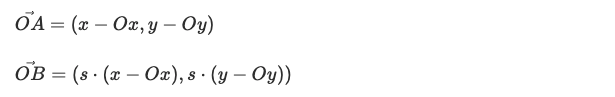

点 **B** 坐标就等于 **OB** 向量加上原点 **O** 的坐标：

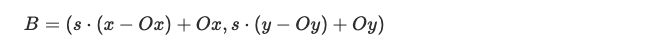

同理得出点 **B'** 的坐标：


**BB'** 的距离就是两点相减后的结果，两点已在上面得出，代入计算过程这里就不多写了，最终化简的结果如下：

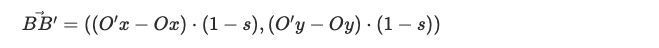

在进行缩放时我们主动改变 `scale` 的值，**s** 是已知的，双指落下时我们手动改变了缩放原点，**(Ox , Oy)** 和 **(O'x , O'y)** 也是已知的，那么根据上面的式子就可以得出 **BB'** 的实际距离了，也就是图像的偏移量，我们回到代码中，在双指缩放时将这个偏移量减掉，同样的在PC端的缩放中，我们也加入偏移量的修正：

```js
let scaleOrigin = { x: 0, y: 0, }
// 获取中心改变的偏差
function getOffsetCorrection(x = 0, y = 0) {
  const touchArr = Array.from(touches)
  if (touchArr.length === 2) {
    const start = touchArr[0][1]
    const end = touchArr[1][1]
    x = (start.offsetX + end.offsetX) / 2
    y = (start.offsetY + end.offsetY) / 2
  }
  origin = `${x}px ${y}px`
  const offsetLeft = (scale - 1) * (x - scaleOrigin.x) + offset.left
  const offsetTop = (scale - 1) * (y - scaleOrigin.y) + offset.top
  scaleOrigin = { x, y }
  return { left: offsetLeft, top: offsetTop }
}

window.addEventListener('pointermove', (e) => {
  // .......
      // 双指缩放
      touches.set(e.pointerId, e)
      const ratio = getDistance() / lastDistance
      scale = ratio * lastScale
      offset = getOffsetCorrection()
      changeStyle(cloneEl, ['transition: all 0s', `transform: translate(${offset.left + 'px'}, ${offset.top + 'px'}) scale(${scale})`, `transform-origin: ${origin}`])
  // ........
})

// 滚轮缩放
const zoom = (event) => {
  // ........
  offset = getOffsetCorrection(event.offsetX, event.offsetY)
  changeStyle(cloneEl, ['transition: all .15s', `transform-origin: ${origin}`, `transform: translate(${offset.left + 'px'}, ${offset.top + 'px'}) scale(${scale})`])
}
```

最终双指缩放效果如下，啊~ 如此丝滑，不由得流下两行热泪

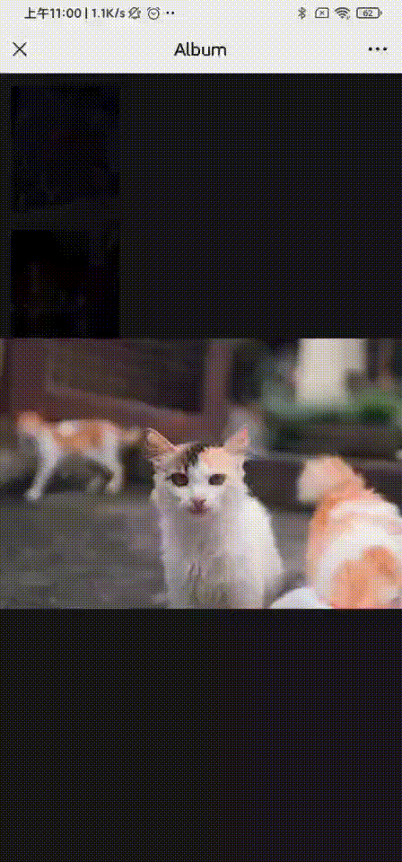


## 一些细节

有些在正文中未提及，但同样重要的小细节。

### 是什么阻止了滚动？

虽然浏览器**滚动**对应的其实是 `scroll` 事件，但我们在PC上滚动通常都是用利用**滚轮**(笔记本触控板也被视作滚轮)，所以在**滚轮事件**中**阻止系统默认事件**也就阻止了滚动，但不是完全阻止，因为滚动条没隐藏的话还是可以拖动来滚动页面的，在本文例子中并没有针对**滚动**做什么处理，如果需要完全禁止滚动，应该在打开弹窗时为 `body` 设置 `overflow` 为 `'hidden'`。

> 注意**滚轮事件**(`wheel`)是可以触发**冒泡**捕获的，而**滚动事件**(`scroll`)却**无法触发**冒泡，了解更多可以看我之前的一篇文章：[哪些浏览器事件不会冒泡](https://juejin.cn/post/7136057532246097928#heading-0)。

至于移动端又是为什么阻止了滚动呢？得益于一个强大且容易被忽略的`CSS`属性，可能在开头布局部分你就发现了这个属性，没错，这里为弹层遮罩设置了 `touch-action: none;` 从而阻止了所有手势效果，自然也就不会发生页面滚动。该属性在平时的业务代码中也可用于优化移动端性能、解决 `touchmove` 的 `passive` 报错等，这个我在之前另一篇文章中有提到，感兴趣可以看看：[一行CSS提升页面滚动性能](https://juejin.cn/post/7134648288925450248)。

### translateZ(0) 有什么用？

在本例的代码中这个**CSS**本身是没有意义的，为的只是触发**3D加速**来提升性能，那为什么不直接使用 `translate3d()` 呢？又或者使用 `will-change: transform;` 来告诉浏览器提升转换渲染性能呢？

| 正常图片显示 | 使用了 translate3d 之后 |
| --- | --- |
| 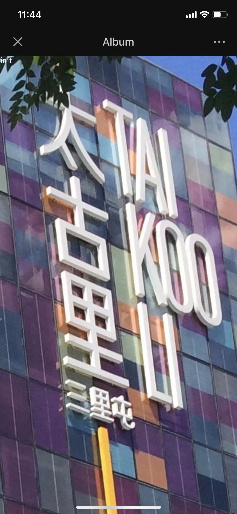 | 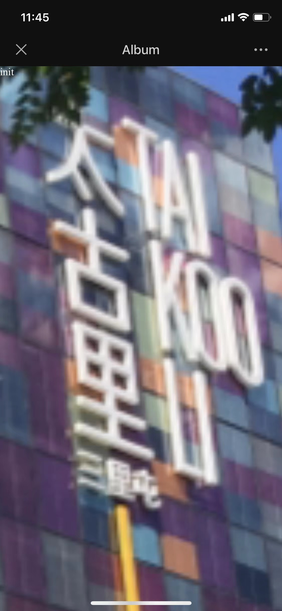 |


答案是后两者都会使**移动端的图片变模糊**！起初我发现图片在手机上模糊的问题时，调试很久都没定位到源头，一筹莫展之际想起以前做图片预览都是使用 **vant**，那就看看它的源码吧，很快我找到[相关代码位置](https://github.com/youzan/vant/blob/main/packages/vant/src/image-preview/ImagePreviewItem.tsx)，代码截图：

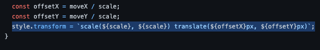

从代码片段中我看到 **vant** 并没有使用任何 `translate3d` 或 `scale3d` 属性，看来是真的有坑了。其实我们使用 `translate3d` 也是把第三个参数一直设置为`0`（2d平面没有Z轴），这和 `translateZ(0)` 是等价的，但奇怪的是单独设置 `translateZ` 却没有引发问题。

> `will-change` 这个属性，我也是最近无意中发现的，根据 **MDN** 文档的描述，该属性是用于提升性能的**最后手段**，怎么理解这句话呢？根据上面实践的结论来看，应该可以认为是浏览器尝试牺牲掉一些画面质量来换取性能提升的一种手段。

## 完整代码

[代码片段](https://code.juejin.cn/pen/7158337368355766285)

> 代码片段的链接在文章中会直接嵌入编辑器，可以点其右上角  这里进入更方便详细地查看代码。

## 结束