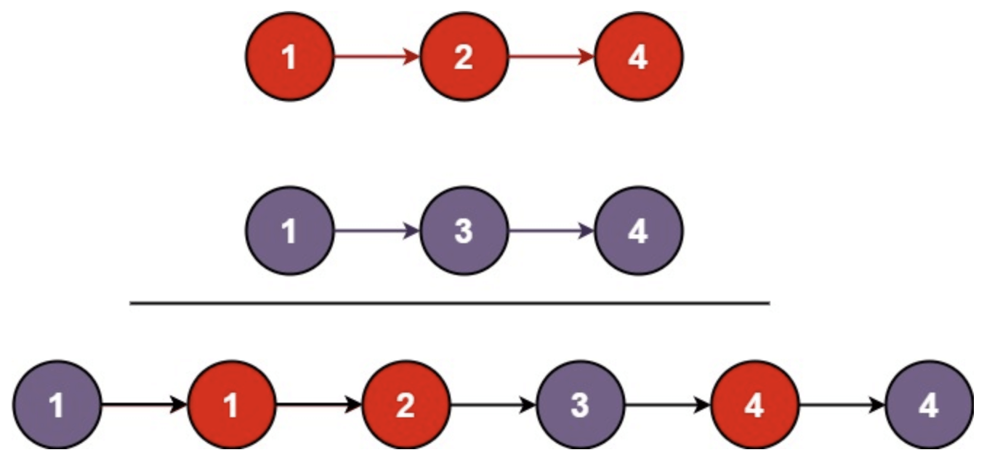

[🔥 LeetCode 热题 HOT 100](https://leetcode.cn/problem-list/2cktkvj)

适合初识算法与数据结构的新手和想要在短时间内高效提升的人，熟练掌握这 100 道题，你就已经具备了在代码世界通行的基本能力。

## 简单

### 1. 两数之和

### 20. 有效的括号

给定一个只包括 '('，')'，'{'，'}'，'['，']' 的字符串 s ，判断字符串是否有效。

[题目直达链接](https://leetcode.cn/problems/valid-parentheses/?favorite=2cktkvj)

### 21. 合并两个有序链表

将两个升序链表合并为一个新的 升序 链表并返回。新链表是通过拼接给定的两个链表的所有节点组成的。 

[题目直达链接](https://leetcode.cn/problems/merge-two-sorted-lists/?favorite=2cktkvj)

