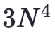
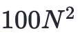
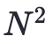
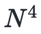

 他奠定了当今计算机算法的规范化和量化度量

如今的我们对算法可谓并不陌生，由于互联网发展迅猛，哪怕没有系统学习过计算机底层理论的程序员，也接触过无数的算法。

昨天笔者看到一个开放性思考题，内容是这样的：

> 如果一个程序只运行一次，在编写它的时候，你是采用最直观但是效率较低的算法，还是依然寻找复杂度最优的算法？

可能你心中已有答案，但这个问题我们放到文末再聊，本篇主要是科普向的算法入门文章，我将从最初的计算机讲起，用通俗易懂的话来带你重新认识下算法。

## 前言

图灵提出了计算机的数学模型、冯·诺依曼确定了计算机通用的系统结构，而如果要问图灵和冯·诺依曼之后对计算机科学贡献最大的人是谁，那就不得不提到**高德纳**了，正是他奠定了计算机**算法的基础**。我们知道，没有控制程序，只有一系列硬件算不上是计算机，程序之于计算机是必不可少的，而程序的**灵魂**，就在于**算法**。

## 计算机诞生之初

在早期计算机领域里，哪些控制功能要通过开关电路做成**硬件**，哪些又该由**程序**控制，这些边界其实不像如今这么清晰。

教科书上对**世界第一台通用计算机**的定义，是20世纪40年代所研制的电子计算机埃尼阿克（**ENIAC**），而事实上这台计算机在研制时也没有搞清楚程序是怎么一回事，它说到底还是一台**专用计算机**，主要用于解决远距离导弹发射过程的计算问题。是的，计算机的起源并没有想象中的美好，它来自人类对战争的渴望。

当时的**冯·诺依曼**正服务于美国军方，负责氢弹工程，也需要进行**大量的计算**，听说了电子计算机研制的事情，就跑过去想看看能不能解决氢弹计算问题，而他也马上发现了这台计算机的巨大缺陷：如果 ENIAC 要计算其他问题，只能修改线路，但改线路会非常麻烦，处理一个几分钟就能算好的问题，要几个月的时间来改线路，效率之低下可想而知。但面对已经造了一半的 ENIAC，冯·诺依曼也只能表示无解。

美国军方在了解了这个情况后，于1944年决定再造一台新的**通用计算机**，这次由冯·诺依曼和约翰·莫奇利、埃克特（两位 ENIAC 的研发者）一起主导设计，称为 **EDVAC** (离散变量自动电子计算机)，所以它其实才是世界上第一台由程序控制的通用电子计算机，甚至可以说是今天所有计算机的原型，而 **ENIAC** 则是一个孤版。

> 1946年 ENIAC 诞生后，科学家们用它进行了一次计算长程火炮弹道轨迹演示，以至于现场观摩的蒙巴顿元帅看的目瞪口呆，说了一句“真快啊，简直是带电的大脑”，“电脑”一词就是这么来的。

## 算法理论起源

在 **EDVAC** 之后，客观上计算机已经分为了**软硬件**两个部分，随后的十多年里，整个行业关注的都是硬件，从电子管、晶体管、再到第三代继承电路，计算机硬件在不断演变，但早期的软件算法却很简单，因为大多数用来进行科学计算，很多程序在编写完成之后其实用不了几次，因此没有人重视它们的质量。

而到了60年代，计算机开始在商业上普及，一个程序是需要提供给用户反复使用的，这时候人们才真正重视起**程序设计**，而计算机算法理论的缺失，就要有人来弥补了，这个人就是文章开头提到的**高德纳**。

> 关于高德纳这个中文名的由来，大部分的英文名我们通常都会以音译形式来取，但高德纳这个名字与其英文名 Donald Ervin Knuth（唐纳德·尔文·克努斯）还是有一定差别的，在1977年时，高德纳作为最早受到中国邀请讲学的专家来华访问，临行前他就想给自己起一个中文名，当时姚期智（图灵奖获得者）的夫人储枫便给他起了这个名字。

高德纳在学生时代对物理和音乐都很有兴趣，1956年，他以各科平均97.5分的创记录高分从中学毕业，彼时的他选择了攻读物理专业。

在大学时期，他接触到当时最先进的大型电脑 **IBM 650**，并展现出了在计算机上超凡的才能。当时他写了个程序，用来分析大学篮球联赛中球员在每场比赛的得分、助攻、抢断、篮板球、盖帽等数据，然后让篮球队教练以此挑选球员，最终带领球队赢得了当时全美大学生篮球联赛冠军（这可能是最早的**大数据**在体育界的成功应用了）。后来高德纳也成为当时最好的工程科学期刊编辑，获得了国家奖，于是便从主修物理改成**主修数学**，毕业之后留在加州理工学院任教，并在数学与计算机程序设计领域取得多项成就。

而说起高德纳对计算机行业最伟大的贡献，就不得不提到他编纂的一部系统地介绍计算机程序设计的巨著《**计算机程序设计艺术**》，截至 2018 年 12 月，该书已经出版了 4 卷，高德纳本人预计第 5 卷将会在 2025 年完稿。其中第一卷是《**基础算法**》，比尔·盖茨曾花了很大精力学通了这一卷，此后便一辈子都在向人推荐这套书，他直言如果没读过这卷《基础算法》，就很难成为一个优秀的程序员。高德纳本人的说辞更狠：“要是这一卷都看不懂，那就别当程序员了”。（对不起，是我不配了👨🏻‍💻）

高德纳在写书的时候，苦于没有好的编辑排版软件，干脆就自己写了个软件，这就是著名的 **Tex**，此后便成为了迄今为止大多数科技书籍使用的排版程序。

> 高德纳曾出资在全世界悬赏能在 Tex 程序中找到 bug 的人，金额从 2.56 美元开始（高德纳说这是"十六进制的1美元"），随之指数式增加（即2.56、5.12、10.24、20.48.....）他开到第三张支票以后，就再也没有人找出错误了，事实上如果软件的错误超过 18 个，高德纳可能就要破产了，他敢冒着破产的风险提出这个悬赏，说明对自己的代码质量有极高的自信。

## 计算数量级的影响

人们其实本能地对大数没什么概念，比如曾经有一条新闻是这样的：“美国未来 5 年内将投入 20 亿美元开发下一代人工智能”，其实就美国的经济体量来说，20 亿美元根本不算什么，但是这样的消息为什么会变成一条“震惊”的新闻呢，就是因为大家根本数不清这些数到底有多大，只是凭直觉就应该是无穷大的钱。

同样地，人们对计算机的高速也是无感的。比如我说一个页面资源的加载速度本来是 100ms，现在下降到了 1ms，足足快了一百倍。但是绝大多数人的感觉应该是：这两者都足够快了。对我们来说其实都是一眨眼的功夫，没差别的。

在今天，我们要**衡量算法**的好与坏，就必须先明确算法的衡量标准以及测试的方法，通常我们会想到**速度**要快，占用**空间**要小，这两个方向都是对的，关键在于用不同数量级测试的时候，不同算法表现可能会完全不一样。比如以下两个场景：

1. 使用 **1W** 条数据测试时，**算法A** 运行 1ms，**算法B** 运行 10ms
2. 使用 **100W** 条数据测试时，**算法A** 运行 10000ms，**算法B** 运行 6500ms

如果单从场景 1 来判断，那么显然 算法A 更好，而但从场景 2 来看的话，却是 算法B 更优，那么问题来了，到底哪个算法才是“好算法”呢？

## 算法复杂度

在计算机科学发展初期，科学家们对算法的评判看法并不统一，直到1965年尤里斯和查理德首次向世人提出了**算法复杂度**的概念（二人后来因此获得图灵奖），算法的标准此后才开始统一。而最早将算法复杂度严格**度量化**的人，就是高德纳，他也因此被誉为“算法分析之父”。今天，全世界的计算机领域都以高德纳的思想为标准。

高德纳的思想主要包括以下原则：

**1. 在比较算法快慢时，只考虑数据量特别大，大到无穷大的情况。**

为什么要比大数？而忽略掉小数呢？因为计算机的发明就是为了处理大数，那些数据量大到人为无法计算的工作，才是交给计算做的。比如一个商城系统在上线初期往往运行流畅，但是用久了查询就变得很慢，原因就是订单数等等记录一直在与日俱增，数据量只会越来越大，处理的数据只会越来越多，而一个系统如果在初期没有考虑到这些，后期就会有处理不完的bug。

**2. 决定算法快慢的因素只分为两类：不随数据量变化的因素、随数据量变化的因素。**

比如说有两种算法，第一种运算次数是 ，其中 `N` 是处理的数据量；第二种则是 ，前面的 3 也好 100 也好，都是常数，和 `N` 的大小没有直接关联，而当 `N` 非常大的时候， 明显就要比  小很多，在处理的数据量不是很大的时候，这两者算法其实差异并不明显，但是高德纳认为，衡量算法的好坏只需要考虑N趋近于无穷大的情况，因为计算机的任务就是处理远远超过我们想象规模的数据量。

我们可以把一种算法的计算量或占用空间大小写成 `N` 的一个函数 `f(N)`，函数的边界可以用数学上的**大O概念**来限制，如果两个函数设 `f(N)` 和 `g(N)`，在N趋近于无穷大的时候比值只差一个常数，那么他们就被看成同一数量级的函数，即 `O(f(N))` = `O(g(N))`，也就是认为具有相同的**复杂度**。

**3. 不同算法在复杂度上差异哪怕只有一点，执行效率也有天壤之别。**

比如选择排序的平均时间复杂度是 `O(n^2)`，而快速排序的平均时间复杂度是 `O(nlogn)`，两者在对**10亿**数据进行排序的时候计算量分别是大约**100亿次**和大约**30亿次**。

总而言之，**复杂度**、**数量级**、**大O概念**，理解了这些那么你对算法也就有了一定的了解。

## 结尾思考

那么回到开头这个问题：

> 如果一个程序只运行一次，在编写它的时候，你是采用最直观但是效率较低的算法，还是依然寻找复杂度最优的算法？

首先我认为这道题其实没有一个标准答案，因为大多数人都懂得辩证法，会说具体问题要具体分析，我也时常是如此，这种思维当然并没有错。只是当我回顾这些在计算机领域的大师们的事迹时，会发现一些特点：冯·诺依曼原本只想算题，却发明了计算机体系结构；高德纳只想写书，却发明了流行至今的排版软件。为什么大师们偶然为之的事情却常常是别人穷极一生也无法完成的事呢？

其实我们不难发现，除了个人能力的差异外，他们还有着**遇到问题时解决问题的积极态度**，同时他们身上也有一种爱折腾的精神。高德纳讲述他在学习编程时，因为计算机太慢，内存太小，来回编译和改错太花时间，所以他总是不断优化算法，力争一次运行没有错误。正因如此，高德纳在硅谷参加编程比赛与众多顶级大咖同台竞技时，也总是用一台最慢的计算机获得第一名。

计算机是认死理的，但程序员并不是。如果一个程序只运行一次，是采用直观但低效的算法，还是寻找复杂度最优解的算法，其实代表的是两种对待问题的态度，况且谁又能保证一个程序真的只会运行一次呢？而对待问题的态度如果是积极的，即使程序只会运行一次，我们也可以尝试去寻找最优解。人的一生会遇到无数的问题，对待问题的态度往往决定了个人的命运。即使你没有超凡的才能，不求闻名于世，你所做的每一个积极的决策，或许都会对你的未来产生深远的影响。

在当今职场反内卷的浪潮中，我们经常会用“躺平”“摆烂”来作为纾解和释放的情绪表达，其实真正内卷的人，往往是那些自认为十分努力却努力错了方向的人，作为程序员的我们应该保持独立的思考，警惕陷入无用努力当中，同时也要保持真正地积极的态度。纵观计算机的发展史，只有积极的态度与探索求知的精神才能不断开辟新的道路，与诸君共勉。

> 本文部分观点与例子参考自吴军老师撰写的《计算之魂》
