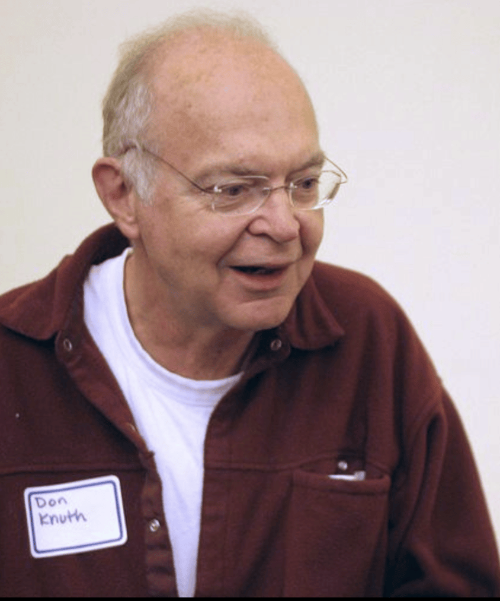
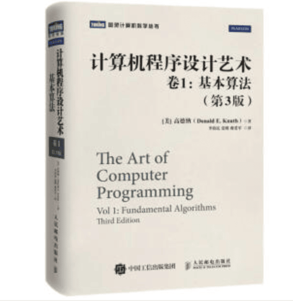

他奠定了当今计算机算法的规范化和量化度量

图灵提出了计算机的数学模型、冯·诺依曼确定了计算机通用的系统结构，如果要问图灵和冯·诺依曼之后对计算机科学贡献最大的人是谁，那就不得不提到高德纳了，是他奠定了计算机算法的基础。我们知道，没有控制程序，只有一系列硬件算不上是计算机，程序之于计算机是必不可少的，而程序的灵魂，就在于算法。

## 计算机诞生之初

在早期计算机领域里，哪些控制功能要通过开关电路做成硬件，哪些又该由程序控制，这些边界很不清晰。教科书上对世界第一台通用计算机的定义，是20世纪40年代所研制的电子计算机埃尼阿克（ENIAC），而事实上这台计算机在研制时也没有搞清楚程序的问题，它说到底也是一台**专用计算机**，主要用于解决远距离导弹发射过程的计算问题。

当时冯·诺依曼正服务于美国军方，负责氢弹工程，也需要进行大量的计算，听说了电子计算机研制的事情，就跑过去想看看能不能解决氢弹计算问题，而他也马上发现了这台计算机的缺陷：如果ENIAC要计算其他问题，只能修改线路，但改线路会非常麻烦，将会直接导致效率低下，但面对已经造了一半的ENIAC，冯·诺依曼也只能表示无解。

美国军方在了解了这个情况后，于1944年决定再造一台新的通用计算机，这次由冯·诺依曼和约翰·莫奇利、埃克特（两位ENIAC的研发者）一起主导设计，称为 EDVAC (离散变量自动电子计算机)，所以它才是世界上第一台由程序控制的通用电子计算机，甚至可以说是今天所有计算机的原型，而 ENIAC 则是一个孤版。

## 算法理论补全

在 EDVAC 之后，客观上计算机已经分为了软硬件两个部分，随后的十多年里，整个行业关注的都是硬件，从电子管、晶体管、再到第三代继承电路，计算机硬件在不断演变，但早期的软件算法却很简单，因为大多数用来进行科学计算，很多程序在编写完成之后其实用不了几次，因此没有人重视它们的质量。而到了60年代，计算机开始在商业上普及，一个程序是需要提供给用户反复使用的，这时候人们才真正重视起程序设计，而计算机算法理论的缺失，就要有人来弥补了，这个人就是文章开头提到的高德纳。

关于高德纳，先说一下他这个正式中文名的由来，大部分的英文名我们通常都会以音译形式来取，但高德纳这个名字与其英文名 Donald Ervin Knuth（唐纳德·尔文·克努斯）还是有一定差别的，在1977年时，高德纳作为最早受到中国邀请讲学的专家来华访问，临行前他就想给自己起一个中文名，当时姚期智（图灵奖获得者）的夫人储枫便给他起了这个名字。

高德纳对物理和音乐都很有兴趣，1956年，他以各科平均97.5分的创记录高分从中学毕业，彼时的他选择了攻读物理专业。

在大学时期，他接触到当时最先进的大型电脑 IBM 650，并展现出了在计算机上超凡的才能。当时他写了个程序，分析大学篮球联赛中球员在每场比赛的得分、助攻、抢断、篮板球、盖帽等数据，然后让篮球队教练以此挑选球员，最终带领球队赢得了当时全美大学生篮球联赛冠军（这可能是最早的大数据在体育界的成功应用了），后来高德纳也成为当时最好的工程科学期刊编辑，获得了国家奖，于是便从主修物理改成主修数学，毕业之后留在加州理工学院任教，并在数学与计算机程序设计领域取得多项成就。

而说起高德纳对计算机行业最伟大的贡献，就不得不提到他编纂的一部系统地介绍计算机程序设计的巨著《计算机程序设计艺术》，截至2018年12月，该书已经出版了4卷，高德纳本人预计第5卷将会在2025年完稿。其中第一卷是《基础算法》，比尔·盖茨曾花了很大精力学通了这一卷，此后便一辈子都在向人推荐这套书，他直言如果没读过这卷《基础算法》，就很难成为一个优秀的程序员。

高德纳在写书的时候，苦于没有好的编辑排版软件，但他自己不就是一个程序员吗，干脆就自己写了个软件，这就是著名的 Tex，此后便成为迄今为止大多数科技书籍使用的排版程序。

> 高德纳曾出资在全世界悬赏能在 Tex 程序中找到 bug 的人，金额从2.56美元开始（高德纳说这是"十六进制的1美元"），随之指数式增加（即2.56、5.12、10.24、20.48.....）他开到第三张支票以后，就再也没有人找出错误了，事实上如果软件的错误超过18个，高德纳可能就要破产了，他敢冒着破产的风险提出这个悬赏，说明对自己的代码质量有极高的自信。

## 计算数量级的概念

