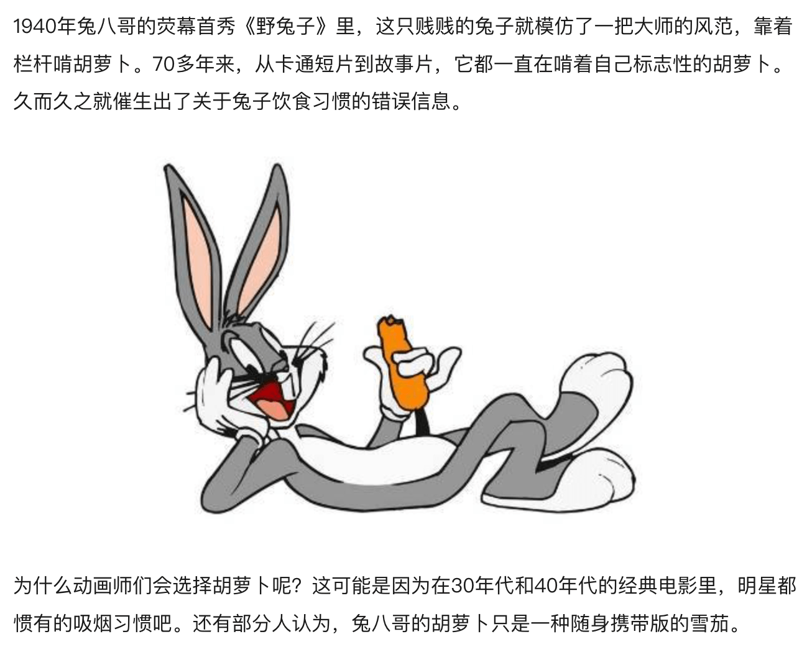
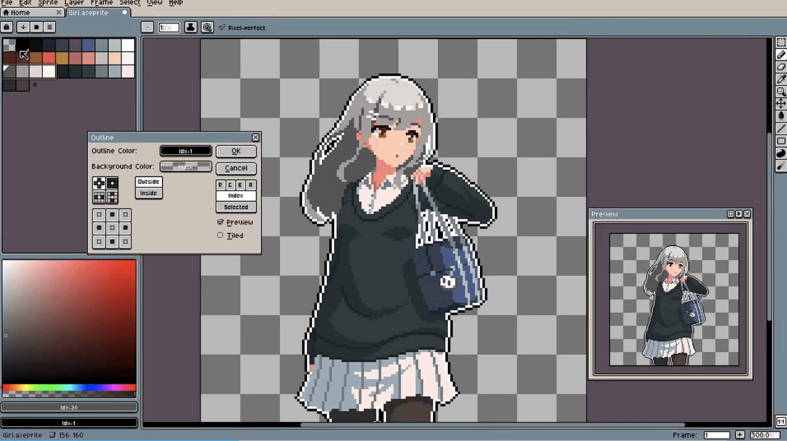
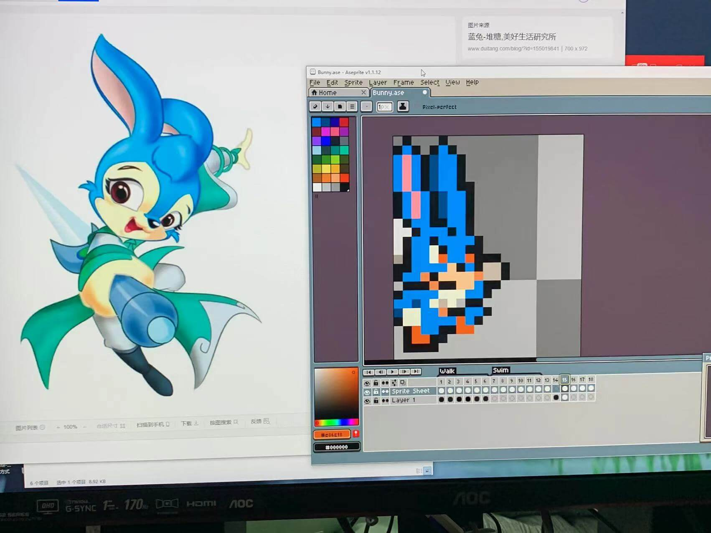
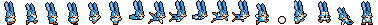
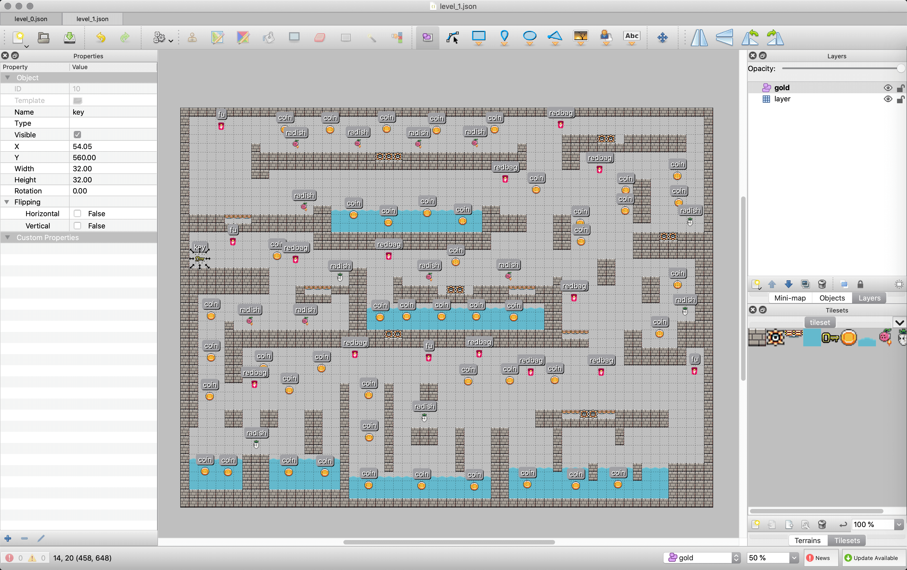
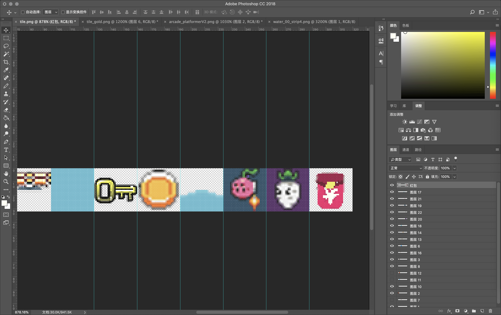
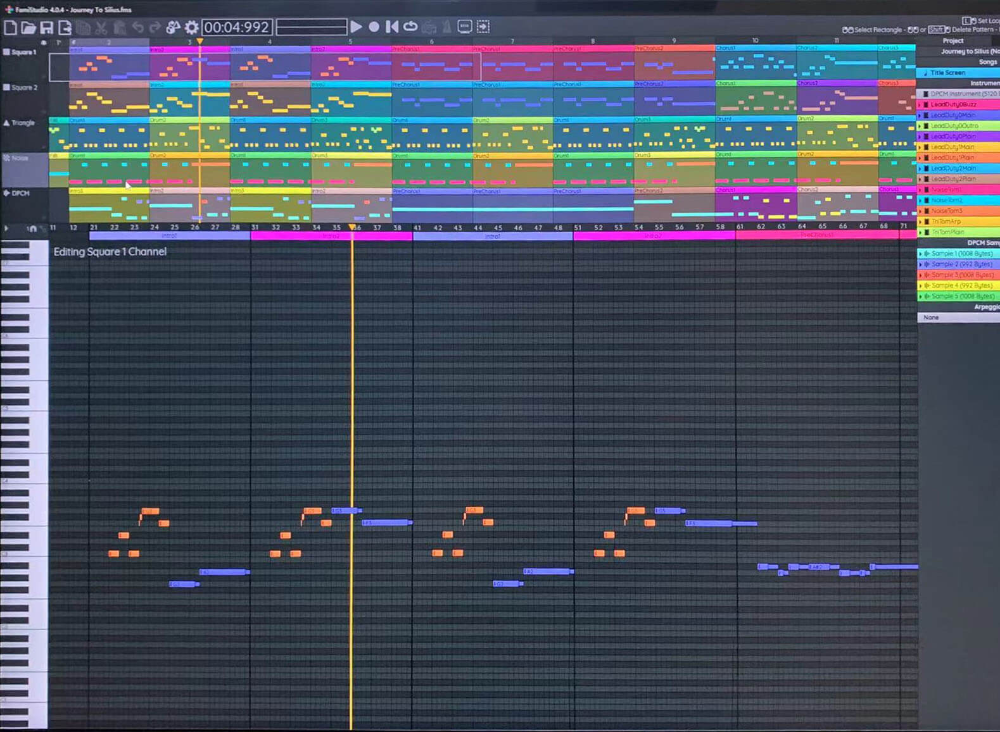
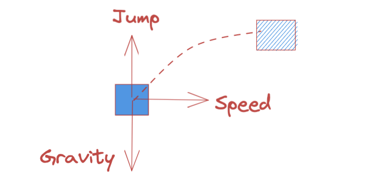

《当一个前端不务正业，三天时间可以做出怎样一款游戏？》

《前端不务正业，三天时间做了一款H5游戏，是种什么体验》

## 前言

游戏名叫 **Carzy Bunny** 疯狂的兔叽，玩家扮演**兔子**，通过简单**点击屏幕**控制跳跃来到处收集**金币**、以及散落的**新年红包**🧧，并最终寻得关卡**钥匙**🔑来通关！

下面你可以在码上掘金中完整体验这个游戏，由于时间问题只制作了两关，但个人感觉还是蛮耐玩的：

而在这篇文章中，我将会分享自己如何在三天时间内设计并完成整个游戏制作的历程。游戏开发框架我选择了之前一直想尝试的 **Phrase3** + **Vite**，而在文章的后半段，我也会详细讲解这个游戏的简单原型，看完你也可以用几十行代码做出这样一个**平台跳跃游戏**，如果感兴趣的话，点赞收藏咱们继续往下看吧~

## 游戏设定

其实说起和**兔子**🐰相关的事物，大部分人的第一反应可能是**胡萝卜**🥕，但事实上兔子是草食性动物，而且也没有相关证据说明兔子爱吃萝卜，之所以我们有这样的刻板印象，多半还是N年前一部国外动画造成的。

> 
> ——资料来源网络

所以在我的游戏设定里，兔子和萝卜之间将会是一对宿敌，其中**胡萝卜**是调皮可爱的反派，会成为主角行进的路上的阻碍。不过我也加入了白萝卜，它看起来比较温顺，~~食用~~(划掉)触碰则会增加积分~

与**Super Mario**一样，玩家可以通过**踩踏**消灭敌人，但不同的是，在这里敌人没有攻击性，玩家触碰不会受伤或死亡，而是使胡萝卜进入**暴走状态**——此时的胡萝卜背上了喷气背包，开始随处飘荡，并且在这个过程中会**偷走**地图上的金币(不包括红包)，如果最终兔子收集的金币没有萝卜多，那么游戏将**宣告失败**！另外如果让胡萝卜拿到通关钥匙，那么你将不得不**重新开始**这一关🤣当然我们玩家兔子并不是没有反制方法，别忘了在任何时候**踩踏**萝卜都能将敌人消灭，当然也包括空中~

这将是一场考验眼力、手速、判断力与心态的冒险旅 ~(兔)~ 途！

## 游戏玩法与机制

在开始制作前，我就确定了游戏的类型为平台跳跃+跑酷的基调，因为兔子总是蹦蹦跳跳的嘛。游戏玩法机制上，当时还找了在做游戏策划的表妹探讨一番，无果~毕竟3D动作大厂的策划，方案我有点hold不住。最后我找到了几年前的一个ios平台跳跃游戏：《Yeah Bunny》，玩法上手难度不高，操作只有一个指令，虽然简单但又不失挑战性，完美符合我对自己游戏的设想：

> | Jump | Double Jump | Step on | Wall
> | --- | --- | --- | --- |
> | 1 | 2 | 3 | 4 |
> 
> 截取自 Yeah Bunny 游戏画面
------


## 美术资源制作

由于是个人开发，时间也有限，在美术资源的选择上毫无疑问是小成本的**像素绘画**，近几年来许多独立游戏制作也都常使用像素风格，像素画的下限低同时上限也高，在大师手中同样能有精良的制作。

> 
> 截图来自 Aseprite 官方宣传视频

这里我用 **PhotoShop** 完成了一部分游戏素材，虽然鼠标也可以操作，不过我还是更习惯用数位板，拿出了尘封已久的Wacom手绘板，给你们看看是真的厚厚灰尘啊擦。。


像素画的制作使用的是 **Aseprite**，在设计主角时我想到了小时候电视上的动画《**虹猫蓝兔三千问**》，于是参考了蓝兔形象配色设计了这个像素兔子：



## 动画制作

**Aseprite** 是一款**免费且开源**的像素画软件，它最大的功能不只是绘制像素画，还能方便地调试动画，这里2D动画使用的是精灵图技术，和我们**CSS**上的雪碧图是一个原理。

在软件中可以像这样打上Tag调试动画，可以看到每一帧都是需要画的，越流畅的动画就需要绘制越多的关键帧，所以2D游戏的开发工作量其实有可能比3D游戏还要大。

--------

然后按 Ctrl + E 导出序列，就可以合成这样一张精灵图：



别看这么小张图，就已经花了我一整天时间。

## 地图制作

现在角色制作好了，我们需要一个给它活动的平台，如果在代码里编写平台地图，工作量是十分巨大的，所以下面介绍一个辅助的工具。

**Tiled** 也是一个**免费且开源**的软件，它可以很方便地制作我们游戏里的地图，右上角区域“Layers”可以看做是图层列表，这里我主要使用两种图层，一种是 **Tile Layer**，用来可视化绘制整个地图，另一个图层是 **Object Layer**，这是一个纯对象图层，我用它来标记敌人的位置、红包/金币的初始位置等，一个地图制作完大概是这样的：



其中的 Tiles 我在 Photoshop 中简单地制作了一下：



最后保存导出的是一个 **JSON** 格式文件，这上面记录了整个地图的点位，游戏引擎中就可以依此渲染出地图场景了，所以可以看出它只是帮我们建立了一个个对象数据，场景中比如敌人和金币，都是有动画的，这里不应该直接渲染出来，这时我们就可以在代码中解析 **Object Layer** 对象，再根据这个对象就可以渲染对应的元素了。制作过程中需要改动地图、增加减少敌人金币，就只需要在软件中修改一下再保存就可以了~

在这张1080P的地图中，像素点大约为200万个，一个贴图像素为32 * 32也就是1024个像素，依次放置元素铺满地图就需要大约1900次，有了工具的辅助大大减少了机械式的工作。

## 音乐制作

对于像素风格游戏来说，配乐就肯定离不开 **8-bit音乐**。

在20世纪80年代时，游戏机的音效、音乐都依靠合成器芯片来制作，所以8-bit音乐也称为芯片音乐。早期电脑并没有如今能发出丰富声音的音响设备，只有能发出单一声音的蜂鸣器，用作提示音，而程序员通过控制信号频率来让蜂鸣器发出不同的声音，用脉冲或是爆炸噪声来模拟鼓点，随着技术的发展和音乐人的努力，芯片音乐也逐渐变得丰富起来。

**FamiStudio**，同样是一个**免费且开源**的软件，它的特点是界面简洁，当然对我来说上手难度还是有点太高了。。

我们知道空气的震动产生**声波**，人耳能听到的**波形**就是我们所理解的**声音**。

芯片音乐一般包括基本波形，如方波，锯齿波或三角波等。简单来讲快速制作一首8-bit音乐有以下几部分组成：

1. 鼓点，也就是我们常说的“动次打次”，使用噪波
2. 低音作曲部分，也就是贝斯旋律，通常用三角波、方形波
3. 主旋律部分，和辅助旋律的制作

通常需要ABC三段来完成，每一段由如上几部分制作，一首完整的BGM就出来了，~是不是狠简单~。虽然我自认为身上还是有点音乐~~细胞~~细菌的，但掌握软件的基本使用就已经劝退我，这时游戏开发已经到了Day3，我选择了放弃。

不过软件中自带了演示小样，我挑了比较适合的Demo直接就拿来游戏里用了~最后放张软件使用的截图给大家感受下：



----

到这里其实就告一段落了，游戏制作是挥洒创意的过程，如果只有代码无疑是单薄的，所以才有了上面这些尝试，我从几年前开始搜集各种小游戏素材与灵感，上面提到的软件也都是在这个过程中沉淀的，直到现在才重新发掘出来使用，制作了这个稍微完整的小游戏。

在游戏制作中**游戏引擎**是必不可少的，作为弱小的**Web前端**开发，我首选的肯定是**JavaScript**引擎，这里我主要使用的是 **Phrase3** 进行开发。在我的理解中，无论使用何种游戏引擎都是差不多的，只有配套的工具与生态不同，而美术音乐等资源则较为通用。

## 物理引擎

如果没有物理引擎，那么可以说直接失去了游戏开发的灵魂。

想象一下，当我们想控制角色起跳，代码上需要做什么事情？其实只需要设置一个**弹跳力**，但这样角色就会一直往天上飞去，所以又要设置一个**重力**，而如果往不同方向跳跃呢？就需要一个方向上的力，这个力的大小由行进**速度**控制：



我们通过控制三个变量设置不同数值，就能模拟物体真实运动，这背后就是**物理引擎**做的功劳。

在 Phrase 中自带了三种物理引擎，分别是：

**Arcade**：轻量级高性能AABB式物理碰撞系统(Axis-aligned Bounded Rectangles)，译为轴对称盒子，只能以**矩形框**计算碰撞区域，精度低，运算速度快。

**P2**：功能更加强大，Arcade所不能实现的**多边形碰撞**区域、弹簧、摩擦力、碰撞材质、反弹系数等都可以实现，但必然会使运算复杂、耗费性能。

**Ninja**：可以实现平面、凹凸面、球面等的碰撞，物体在非平整面上碰撞时不会翻倒。

当然也可以引入外部的物理引擎，就不展开了。下面我们会使用到 **ARCADE** 物理引擎。

## 游戏原型教学案例

开始游戏制作前，先要搞个脚手架，让我们跳过造轮子的步骤，直接到 **Github** 上 `clone` 一个 **phaser3** + **typescript** + **vite** 的模板：

```shell
git clone https://github.com/ourcade/phaser3-typescript-vite-template my-game
cd my-game
yarn / pnpm install
```

安装好依赖启动项目，就可以开始游戏的开发了，`main.js` 为入口文件，在这里我们为 Phrase 进行一些配置：

```js
import Phaser from 'phaser'
import demo from './Demo'

const config: Phaser.Types.Core.GameConfig = {
  type: Phaser.AUTO, // 可以指定 canvas或webGL渲染器
  backgroundColor: '#333333',
  // width: 640,
  // height: 480,
  scale: { // 设置了一些缩放的参数，主要使场景可以自动缩放到屏幕中看得更清楚
    mode: Phaser.Scale.FIT,
    autoCenter: Phaser.Scale.CENTER_BOTH,
    parent: 'app', // 对应我们页面的根节点
    width: 640,
    height: 480,
  },
  physics: {
    default: 'arcade',
    arcade: {
      gravity: { y: 0 },
    },
  },
  scene: [demo], // 场景列表，会按顺序加载
}

export default new Phaser.Game(config)
```

接下来我们创建 `Demo.ts`，一个基本的游戏场景结构如下：

```js
import Phaser from 'phaser'

export default class Demo extends Phaser.Scene {

  constructor() {
    super('Demo')
  }

  preload() {
    // 预加载完成才会执行其它方法，可以调用load.on来捕获完成事件
    this.load.on('complete', () => {
      // ...TODO
    })
  }

  create() {  }

  update() {  }
}
```

其中 `preload` `create` `update` 分别为基本的生命周期。

随意创建两个 32 x 32 像素的贴图：


在 Tiled 软件中编辑一个地图，导出 **JSON** 数据如下，`level.json`：

```json
{ "compressionlevel":-1,
 "editorsettings":
    {
     "export":
        {
         "target":"."
        }
    },
 "height":15,
 "infinite":false,
 "layers":[
        {
         "data":[1, 1, 1, 1, 1, 1, 1, 1, 1, 1, 1, 1, 1, 1, 1, 1, 1, 1, 1, 1, 1, 0, 0, 0, 0, 0, 0, 0, 0, 1, 0, 0, 0, 0, 0, 0, 0, 0, 0, 1, 1, 0, 0, 0, 0, 0, 0, 0, 1, 1, 1, 0, 0, 0, 0, 0, 0, 0, 0, 1, 2684354561, 0, 0, 0, 0, 0, 0, 1, 1, 1, 1, 1, 0, 0, 0, 0, 0, 0, 0, 1, 2684354561, 0, 0, 0, 0, 1, 0, 0, 1, 1, 1, 0, 0, 1, 0, 0, 0, 0, 0, 1, 2684354561, 0, 0, 0, 0, 1, 1, 0, 0, 1, 0, 0, 1, 1, 0, 0, 0, 0, 0, 1, 2684354561, 0, 0, 1, 0, 0, 1, 1, 0, 0, 0, 1, 1, 0, 0, 1, 0, 0, 0, 1, 2684354561, 0, 0, 1, 1, 0, 0, 1, 1, 0, 1, 1, 0, 0, 1, 1, 0, 0, 0, 1, 2684354561, 0, 0, 0, 1, 1, 0, 0, 1, 1, 1, 0, 0, 1, 1, 0, 0, 0, 0, 1, 2684354561, 0, 0, 0, 0, 1, 1, 0, 0, 1, 0, 0, 1, 1, 0, 0, 0, 0, 0, 1, 2684354561, 0, 0, 0, 0, 0, 1, 1, 0, 0, 0, 1, 1, 0, 0, 0, 0, 0, 0, 1, 2684354561, 0, 0, 0, 0, 0, 0, 1, 1, 0, 2684354561, 1, 0, 0, 0, 0, 0, 2684354561, 2684354561, 1, 2684354561, 0, 0, 0, 0, 0, 0, 0, 2684354561, 1, 2684354561, 0, 0, 0, 0, 0, 0, 0, 0, 1, 2684354561, 0, 0, 0, 0, 0, 0, 0, 0, 2684354561, 0, 0, 0, 0, 0, 0, 0, 0, 0, 1, 2684354561, 2684354561, 2684354561, 2684354561, 1, 1, 1, 1, 1, 1, 1, 1, 1, 1, 1, 1, 1, 1, 1, 1],
         "height":15,
         "id":1,
         "name":"layer01",
         "opacity":1,
         "type":"tilelayer",
         "visible":true,
         "width":20,
         "x":0,
         "y":0
        }],
 "nextlayerid":2,
 "nextobjectid":1,
 "orientation":"orthogonal",
 "renderorder":"right-down",
 "tiledversion":"1.3.4",
 "tileheight":32,
 "tilesets":[
        {
         "columns":1,
         "firstgid":1,
         "image":"tile.png",
         "imageheight":32,
         "imagewidth":32,
         "margin":0,
         "name":"tileset01",
         "spacing":0,
         "tilecount":1,
         "tileheight":32,
         "tilewidth":32
        }],
 "tilewidth":32,
 "type":"map",
 "version":1.2,
 "width":20
}
```
