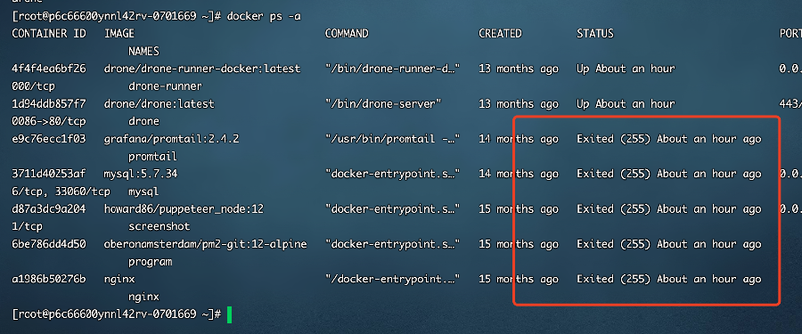

关于我的网站突然崩溃，误以为被攻击这件事

本文记录了一次服务器严重故障的问题排查历程，最后发现是天灾不是人祸，结果还是我太菜了啊。

事情是这样的，那是一个炎热的下午，我正吹着空调欣然品茶，突然命运之手向我伸出了魔爪，打断了我摸鱼的美妙时光——我的所有站点都无法访问了！这让我的心情热得像天气一样火啊！直觉告诉我这是服务器出问题了，于是我赶忙登录查看主机：



事情似乎有点严重啊，我赶紧 check 其它地方：

- linux 系统关键目录均没有遭到破坏，首先排除服务器被黑
- mysql 数据库完好无损，肯定不是勒索病毒

这种奇怪的违和感不知道是怎么回事，但我也松了一口气，至少不是最坏的情况。紧接着我打开了云主机的后台看了一下数据，除了下午三点时的链接数突然飙高以外，没有发现其它异常：

由于之前就一直受到垃圾漏洞扫描工具的骚扰，链接数飙高这种事我已见多不怪，但是发生时机太过巧合，究竟是天灾还是人祸？我一时间也不得而知，所以先整理一下目前的情况：

1. docker 容器基本全报异常退出了，但没有被删
2. 宿主机的容器映射的目录空了，所以现在基本也没办法重新启动容器
3. 容器 drone 还在活跃状态，不过由于 nginx 服务挂了，暂时无法访问

**难道是 Drone 的问题？**

> Drone 是一个持续集成和交付（CI/CD）工具，它可以自动执行软件构建、测试和部署等任务，具有轻量、易于安装和使用等优点。

Drone 作为 CICD 工具，权限本身就较大，不免让我怀疑：难道是它存在什么可被利用的漏洞？

想象一下，密室一间，人有五名，死者四人，难道你不怀疑唯一活着的那个吗？

问题聚焦到 Drone 身上后，我开始从日志数据着手分析：

```shell
docker logs <容器名>
```

看着打印出来最后的日志，我菊花一紧：


“启动僵尸构建死神”是什么神奇东西啊？难道是黑客留下的

--restart=always

当容器在退出后总是会自动重启。


"starting the zombie build reaper" 这个消息通常是 Drone CI 的日志信息，出现这个消息表示 Drone CI 开始清理僵尸构建。

在 Drone CI 中，当一个构建过程完成或失败后，构建容器会被立即删除。但是，在一些情况下，容器可能由于各种原因未能成功删除（例如，出现异常、Docker 容器运行错误等）就造成了残留的构建容器。

这些残留的构建容器就被称为“僵尸容器”，它们会占用服务器计算资源，导致服务性能下降。为了避免这种情况，Drone CI 会启动一个名为 "zombie build reaper" 的定时任务来清理未释放的僵尸容器。

如果您看到上述消息，这表明 Drone CI 已经开始清理僵尸容器，并且这是 Drone CI 的正常行为，无需过多担心。如果您想了解更多关于 Drone CI 的日志信息，可以查看 Drone CI 的文档或者联系 Drone CI 的官方支持。


interval":"24h0m0s" 表示一个时间间隔，其中 "h" 表示小时，"m" 表示分钟，"s" 表示秒。这个时间间隔的意义是每隔 24 小时运行一次任务。

具体地，"24h0m0s" 表示每隔 24 小时运行一次，"12h0m0s" 表示每隔 12 小时运行一次，"1h0m0s" 表示每隔 1 小时运行一次，以此类推。如果需要更精确的时间间隔，也可以使用小数来表示，如 "0.5h" 表示每隔 30 分钟运行一次。


Drone Zombie Build Reaper 不会删除宿主机文件，它只清理 Drone 系统中的僵尸构建记录。在使用 Drone Zombie Build Reaper 插件时，应该注意配置正确的参数，以避免误删除宿主机上的重要文件。


