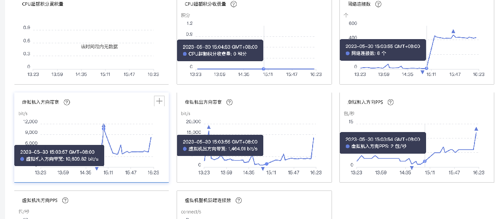
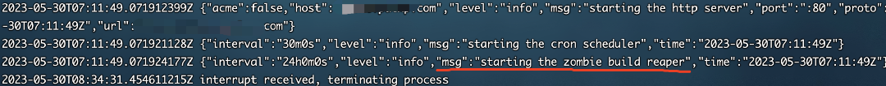
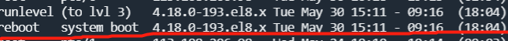
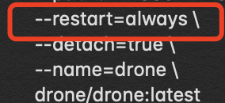

关于我的网站突然崩溃，误以为被攻击这件事

本文记录了一次服务器严重故障的问题排查历程，故事虽然颇为跌宕起伏，最后却发现是天灾不是人祸，虚惊一场，还是我太菜了啊。

事情是这样的，那是一个炎热的下午，我正吹着空调欣然品茶，突然命运之手向我伸出了魔爪，打断了我摸鱼的美妙时光——我的所有站点都无法访问了！这让我的心情热得像天气一样火啊！


直觉告诉我这是服务器出问题了，于是我赶忙登录查看主机，进门直奔 docker：


事情似乎有点严重，我赶紧 check 其它地方：

- linux 系统关键目录均没有遭到破坏，首先排除服务器被黑
- mysql 数据库完好无损，肯定不是勒索病毒

这种奇怪的违和感不知道是怎么回事，但我也松了一口气，至少不是最坏的情况。紧接着我打开了云主机的后台看了一下数据，除了下午三点时的链接数突然飙高以外，没有发现其它异常：



由于之前就一直受到垃圾漏洞扫描工具的骚扰，链接数飙高这种事我已见多不怪，只是时机太过巧合，究竟是天灾还是人祸？我一时间也不得而知，所以先整理一下目前的情况：

1. docker 容器基本全报异常退出了，但没有被删
2. 宿主机的容器映射的目录空了，所以现在基本也没办法重新启动容器
3. 容器 drone 还在活跃状态，不过由于 nginx 服务挂了，暂时无法访问

**难道是 Drone 的问题？**

> Drone 是一个持续集成和交付（CI/CD）工具，它可以自动执行软件构建、测试和部署等任务，具有轻量、易于安装和使用等优点。

### 方向开始跑偏

Drone 作为 CICD 工具，权限本身就较大，不免让我怀疑：难道是它存在什么可被利用的漏洞？

想象一下，密室一间，人有五名，死者四人，难道你不怀疑唯一活着的那个吗？

问题聚焦到 Drone 身上后，我开始从日志数据着手分析：

```shell
docker logs <容器名>
```

看着打印出来最后的日志，我不禁菊花一紧：



“启动僵尸构建死神”？难道是黑客留下的什么中二宣言？

脑子虽然转不过来，但是我手没有停，赶紧去查了下这是什么东西：

> "starting the zombie build reaper"，出现这个消息表示 Drone CI 开始清理僵尸构建。
>
> 在 Drone CI 中，当一个构建过程完成或失败后，构建容器会被立即删除。但是，在一些情况下，容器可能由于各种原因未能成功删除（例如，出现异常、Docker 容器运行错误等）就可能残留构建容器。
>
> 这些残留的构建容器就被称为“僵尸容器”，于是 Drone CI 会启动一个名为 "zombie build reaper" 的定时任务来清理未释放的僵尸容器。
>
> interval":"24h0m0s" 表示一个时间间隔，其中 "h" 表示小时，"m" 表示分钟，"s" 表示秒。这个时间间隔的意义是每隔 24 小时运行一次任务。

好了，误会解除，它只清理 Drone 系统中的僵尸构建记录，其它 docker 日志也未检查出当天有什么异常记录。

虽然没有直接证据，也无法解释它如何能够“删除”宿主机文件，但此时 Drone 的嫌疑还未解除，直到出现了新的线索。

### 服务器异常重启

由于实在排查无果，我将事情经过告诉了一位后端大神，在大神的一番操作下，最终在系统记录中发现异常，终于离真相前进一步：

```shell
last -x
```



该命令用于显示系统中所有用户的登录历史信息，其中一条记录显示了在案发当天下午三点，有一次重启记录，为系统操作。

由于有了服务器异常重启这个新发现，我立刻注意到了之前的盲点，由于我服务器有两块磁盘，而 docker 容器中映射的文件目录我都存在了数据盘中，如果是因为重启的原因，磁盘未重新挂载，那么所牵连的 docker 容器自然也就全挂掉了。


可以使用 `lsblk` 或 `blkid` 命令查看系统中所有磁盘分区信息，例如：

```shell
# lsblk

NAME   MAJ:MIN RM SIZE RO TYPE MOUNTPOINT
vda    253:0    0  40G  0 disk 
|-vda1 253:1    0   4G  0 part [SWAP]
`-vda2 253:2    0  36G  0 part /
vdb    253:16   0  20G  0 disk 
`-vdb1 253:17   0  20G  0 part
```

这里的 `MOUNTPOINT` 就是挂载点，对应的磁盘显示为空即是卸载状态。

看来宿主机的映射文件不是被删除了，而是因为数据所在的磁盘未挂载！我赶紧将数据盘挂载了回去，原本消失的映射目录数据全都回来了。

这下我 docker 中的容器就都能够重新启动了，再用 Drone 走一遍自动部署，我的小网站们又悉数恢复如初，到这里问题就已经解决。


> 由于挂载磁盘的目录是允许同时存在的，例如说系统盘可以有一个 `/data` 的目录，里面存在一些文件，那么用另外的数据盘挂载到 `/data` 这个目录后，原本的那些文件就查找不到了，但是并不会消失，同时卸载了该数据盘就会显示原来系统盘上存在的文件。

所以说服务器挂载磁盘 **一定要设置自动挂载** 啊！出问题时很难直观的发现数据盘是否已卸载。

**如何设置开机自动挂载磁盘**：

1. 新建或编辑 `/etc/fstab` 文件，添加需要挂载的磁盘分区的信息，例如：

```
# 设备名         挂载点            文件系统类型   挂载选项            是否备份和自检
UUID=xxxxx-xxxx     /            xfs          defaults            0 0
```

2. 修改完文件后，使用 `mount -a` 命令测试 `/etc/fstab` 文件是否设置正确。该命令会自动挂载所有在 `/etc/fstab` 文件中定义过的文件系统。

3. 重启系统，确认系统能够自动挂载之前定义的磁盘分区。

### 拨开疑云

在真相浮出水面之后，再回头看，为什么在服务器重启后 drone 的容器还是活跃状态？这是因为我当初在构建容器时，CV 官网的命令没注意其中有这样一条配置：



`--restart=always` 代表当容器在退出后总是会自动重启。

所以系统重启后，所有 docker 任务都挂了，但 drone 由于之前构建的时候就配置了自动重启，于是在不知情的我看来它就成了本案中疑点最大的地方。

### 工单投诉

虽然事情解决了，原因也搞清楚了，元凶还没抓住。

前面提到的系统重启操作，该操作记录和我在云主机平台操作留下的记录是一模一样的，但是事发当天我并没有到后台操作过。

所以还能怎么办呢，只能去提个工单了：


客服很快打来了电话，语速很快生怕我听懂他在说什么，翻来覆去就是说什么“宿主机什么故障导致你的服务器重启”云云，问说是什么具体原因就说是“涉及底层架构的问题”，反正就差说他们服务器腊鸡不稳定了，我也不为难工程小哥，看得出他也是在背话术而已。


这里还是要 diss 一下天翼云的服务器，这些年用过阿里云、腾讯云，都没出过类似问题，天翼云也用了一段时间了，本以为电信背书但没想到这么拉跨，传说中的土豆服务器吗？


还好到最后发现不是什么大问题，杯里的茶又喝到没味道了，原来已经到快下班的时间了吗？今天还什么都没干呢！算了，收拾收拾先下班吧，明天再摸。

唉，今日又是茶无味的一天啊。

> 以上就是文章的全部内容，感谢看到这里，希望能对你有所帮助或启发~ 如果觉得文章还不错，可以点赞收藏关注一条龙，我也会持续更新~ 我是茶无味，一名前端开发，
> 茶无味的一天是比喻日常生活过于平淡，单调且缺乏活力，没有新鲜感和激情，就像喝了没味道的清水一样。
>
>为了让生活更有意义和创造感，我们可以通过学习新的知识和技能，尝试新的事物和经历，结交新的朋友和社交圈子，开阔眼界和思维，享受生命中的美好事物，从而让我们的日常生活更加丰富多彩，充满激情和活力。
>
> 如果你也像我一样，那我觉得这件事，____辣！