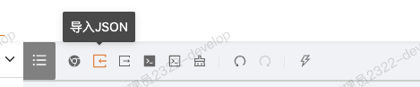
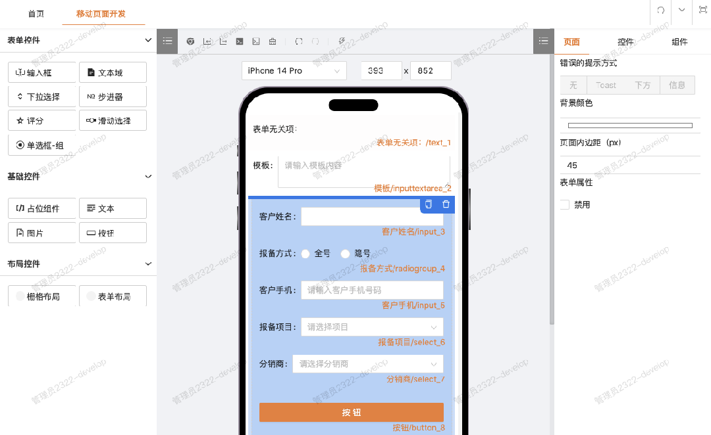
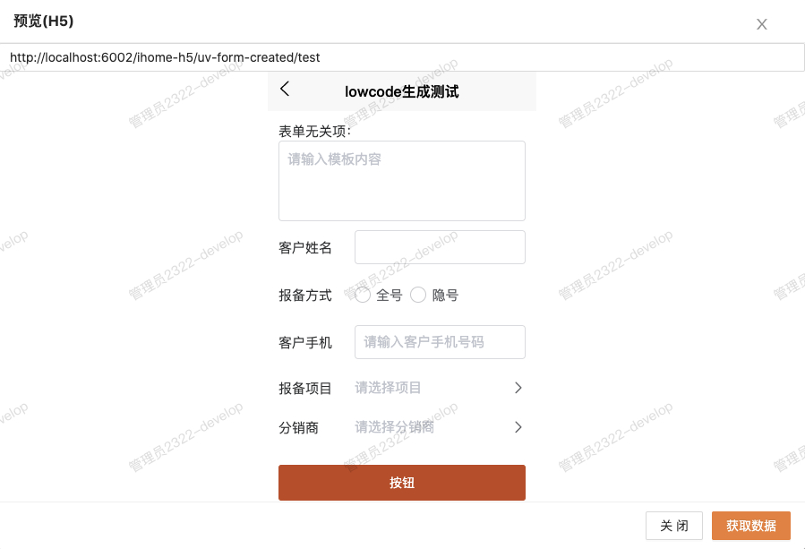
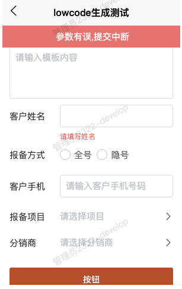
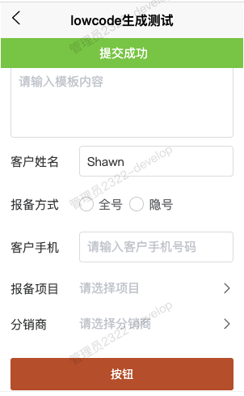
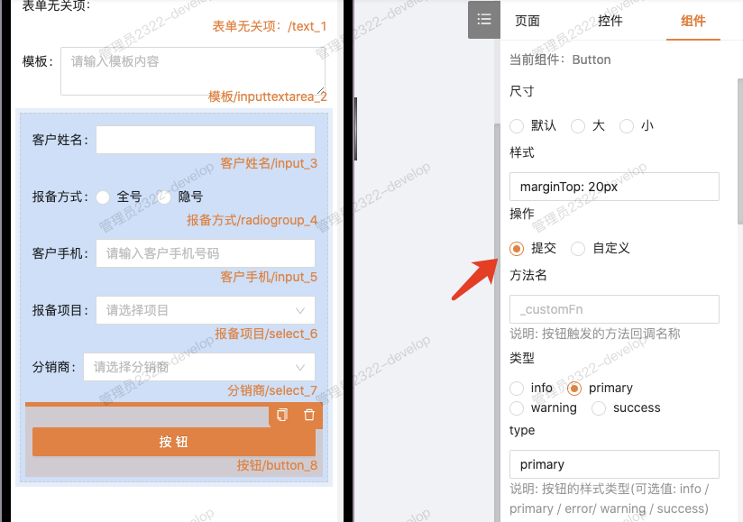

## 什么是低代码

### 概念

低代码概念早已经火过，虽然存在着不同的声音，但是不可否认的是，许多公司依然是投入到了各类低代码应用的开发当中。

例如阿里钉钉的跨平台协作，后来衍生了宜搭这个平台，也开源了一套[通用低代码引擎 (11.5k Star)](https://lowcode-engine.cn/index)，还有字节飞书的审批流程、自动化表单等等，百度也是开源了一套低代码前端框架 [amis (14k Star)](https://aisuda.bce.baidu.com/amis/zh-CN/docs/index)。

从整体上讲，低代码能带的好处主要有以下几点：

1. 减少页面开发工作量，提升效率
2. 降低上手成本、快速响应业务需求
3. 增加代码容错率，人工手写的内容难免会出错
4. 有利于沉淀组件，可以把低代码当做UI库来使用，灵活扩展

低代码不适合做什么：

1. 大量定制 UI，追求丰富个性化视觉效果的前端页面
2. 极为复杂或特殊的交互场景（如编辑器、绘图连线等 ）

### 低代码与零代码

零代码：业务人员通过拖拽等方式，无需编写代码，即可快速搭建各种应用。这种无代码方式只适合单点场景的应用，扩展性很差，主要的设计考虑在易用性层面。

低代码：主要面向开发人员（特别是对前端不熟悉的开发），通过自动代码生成和可视化编程，只需少量代码，即可快速搭建页面。低代码既要考虑一定的易用性，也要充分保证灵活性、可扩展性(代码增强)，这种混合开发能够基本满足具有复杂场景交互的应用。

总的来说，低代码即是把 90% 的工作交给程序去完成，而开发人员只需要负责“**走完最后的一公里路**”。

### 低代码的核心原理

以一种协议的方式定义展示页面与组件的抽象化数据，通常称之为 Schema，以 JSON 的数据格式来表示。

平台层：核心就是可视化编辑操作数据，转化(翻译)代码

业务层：引入低代码的物料（组件库），与转化的代码，然后进行渲染与增强

## 低代码实现

基于一套表单设计器进行二次开发，以便在前期就拥有画布属性配置等基本操作的能力。

以平台层为核心生成代码，接着在编辑器中增强代码，完成业务需求开发。

### 平台层（低代码引擎）

涉及到画布渲染，拖拽组件，选中态右侧属性编辑，鼠标拖拽识别、边缘探测等能力，基本功能如导入导出、撤销重做、复制删除、代码编辑等等，其次是渲染过程对 schema 的运行时适配以及性能优化，此外还有出码模块的自动生成解析器，可能涉及到语法分析和转化。

```
formDesign
├── components
│   ├── VFormDesign
│   │   ├── components
│   │   │   ├── CodeModal.vue  //  Code界面
│   │   │   ├── ComponentProps.vue  // 组件选中态右侧属性面板
│   │   │   ├── FormItemColumnProps.vue  // 表单项属性
│   │   │   ├── FormItemProps.vue  // 表单项属性
│   │   │   ├── FormNode.vue  //  拖拽节点控件
│   │   │   ├── FormNodeOperate.vue  // 节点操作复制删除控件
│   │   │   ├── FormOptions.vue  // 选项操作控件
│   │   │   ├── FormProps.vue  // 原表单属性面板，现在为全局页面配置，基本用不到
│   │   │   ├── IPhone.vue  // 手机界面的显示
│   │   │   ├── ImportJsonModal.vue  // 导入数据面板
│   │   │   ├── JsonModal.vue // 渲染JSON数据
│   │   │   ├── LayoutItem.vue  // 表单项布局
│   │   │   ├── PreviewCode.vue  // Code预览
│   │   │   ├── RuleProps.vue  // 正则校验选项组件
│   │   │   └── hooks
│   │   │       └── createCode.ts
│   │   ├── config   // 右侧控制属性面板的对应选项
│   │   │   ├── componentPropsConfig.ts
│   │   │   ├── formItemPropsConfig.ts
│   │   │   └── props
│   │   │       ├── input.ts
│   │   │       ├── ...........
│   │   ├── index.vue  // 界面入口
│   │   ├── modules // 模块
│   │   └── styles // 样式
│   ├── VFormItem // 负责渲染组件具体内容，调用的基础库是Ant-Design
│   │   ├── index.vue
│   │   └── vFormItem.vue
│   ├── VFormPreview // 预览界面，不能支持移动端，所以嵌入了iframe来模拟
│   └── index.ts  // 这里主要是用于注册全局组件，不过项目本身已全量导入
├── core   // 左侧组件选项的配置
│   ├── formItemConfig.ts
│   ├── iconConfig.ts
│   └── props
│       └── ...........
├── index.vue  //  基础入口文件
├── hooks
│   ├── useFormDesignState.ts
│   ├── useFormInstanceMethods.ts
│   └── useVFormMethods.ts
├── typings
│   ├── base-type.ts
│   ├── form-type.ts
│   └── v-form-component.ts
└── utils
    ├── index.ts
    └── message.ts
```

### 业务层

```
uv-form-created
├── comps
│   ├── BaseForm.vue
│   ├── CompItemBox.vue
│   ├── CreatForm.vue
│   ├── FormItems  // 低代码物料（基础组件库）
│   │   └── .........
│   └── index.ts  // 自动导入所有组件
├── hooks
│   └── tools.ts
├── server // 用于mock数据、本地代码调试等
├── page_01.vue  // 自动生成的组件
├── page_01_codeMixin.ts  //  代码增强文件
└── utils  // 一些工具函数
    ├── http.ts // 封装网络请求
    ├── schemasProxy.ts // schema增强操作工具
    ├── diffObject.ts
    └── uiadmin2json  // 用于快速生成基于u-view的基础组件属性配置
        ├── index.js
        ├── json // 自动生成的组件翻译配置
        └── uview // 自动生成的u-view组件文档
```

**`main.ts` **自动导入物料****：

```js
import installModules from '@/uv-form-created/comps'

......
  const app = createSSRApp(App);

  installModules(app)
......
```

### 基础使用

1. 直接拖拽开始
2. 导入JSON数据



以下这段 Schema 创建了一个文本元素与一个输入域元素，接着创建了带有5个字段的表单，和一个按钮：

```json
{
  "labelWidth": 45,
  "background": "#ffffff",
  "schemas": [
    {
      "component": "Text",
      "label": "表单无关项：",
      "field": "text_3",
      "componentProps": {},
      "colProps": {
        "span": 24
      },
      "itemProps": {
        "labelCol": {},
        "wrapperCol": {}
      }
    },
    {
      "component": "InputTextArea",
      "type": "formItem",
      "label": "模板",
      "field": "inputtextarea_4",
      "colProps": {
        "span": 24
      },
      "componentProps": {
        "placeholder": "请输入模板内容"
      },
      "itemProps": {
        "labelCol": {},
        "wrapperCol": {}
      }
    },
    {
      "field": "form_6",
      "component": "Form",
      "label": "表单布局",
      "componentProps": {
        "labelWidth": 85,
        "_apiUrl": "api"
      },
      "columns": [
        {
          "span": 24,
          "children": [
            {
              "component": "Input",
              "type": "formItem",
              "label": "客户姓名",
              "field": "input_5",
              "colProps": {
                "span": 24
              },
              "componentProps": {
                "type": "text",
                "rule": "{ \"type\": \"string\", \"required\": true, \"message\": \"请填写姓名\", \"trigger\": [\"blur\", \"change\"] }"
              },
              "itemProps": {
                "labelCol": {},
                "wrapperCol": {}
              }
            },
            {
              "component": "RadioGroup",
              "label": "报备方式",
              "field": "radiogroup_6",
              "colProps": {
                "span": 24
              },
              "componentProps": {
                "options": [
                  {
                    "label": "全号",
                    "value": "1"
                  },
                  {
                    "label": "隐号",
                    "value": "2"
                  }
                ]
              },
              "itemProps": {
                "labelCol": {},
                "wrapperCol": {}
              }
            },
            {
              "component": "Input",
              "type": "formItem",
              "label": "客户手机",
              "field": "input_7",
              "colProps": {
                "span": 24
              },
              "componentProps": {
                "type": "text",
                "placeholder": "请输入客户手机号码"
              },
              "itemProps": {
                "labelCol": {},
                "wrapperCol": {}
              }
            },
            {
              "component": "Select",
              "type": "formItem",
              "label": "报备项目",
              "field": "select_8",
              "colProps": {
                "span": 24
              },
              "componentProps": {
                "keyName": "label",
                "keyValue": "value",
                "options": [
                  {
                    "label": "有分销商",
                    "value": "1"
                  },
                  {
                    "label": "无",
                    "value": "2"
                  }
                ],
                "placeholder": "请选择项目"
              },
              "itemProps": {
                "labelCol": {},
                "wrapperCol": {}
              }
            },
            {
              "component": "Select",
              "type": "formItem",
              "label": "分销商",
              "field": "select_9",
              "colProps": {
                "span": 24
              },
              "componentProps": {
                "keyName": "label",
                "keyValue": "value",
                "options": [
                  {
                    "label": "分销商1",
                    "value": "1"
                  },
                  {
                    "label": "分销商2",
                    "value": "2"
                  }
                ],
                "placeholder": "请选择分销商"
              },
              "itemProps": {
                "labelCol": {},
                "wrapperCol": {}
              }
            },
            {
              "component": "Button",
              "label": "按钮",
              "field": "button_10",
              "componentProps": {
                "block": true,
                "type": "primary",
                "handle": "submit",
                "style": "marginTop: 20px"
              },
              "colProps": {
                "span": 24
              },
              "itemProps": {
                "labelCol": {},
                "wrapperCol": {}
              }
            }
          ]
        }
      ],
      "colProps": {
        "span": 24
      },
      "itemProps": {
        "labelCol": {},
        "wrapperCol": {}
      }
    }
  ]
}
```

导入后页面展示结果：



在预览界面可以看到渲染结果：



现在点击表单中的“按钮”，会弹出表单校验错误的提示，输入必填项，点击校验成功：

| 表单校验错误 | 表单校验成功 |
| --- | --- |
|  |  |

出现这个效果是因为表单中的按钮设置为了“提交”预设，我们选中按钮组件，切换到“组件”属性面板可以看到：



而“客户姓名”输入框的校验是因为我们在对象中为其配置了 `rule` 校验规则。

### 生成代码结构

点击“查看代码”，我们会看到下面这个代码结构：

```js
<!-- 本文件由系统自动生成，请通过 Code Mixin 增强代码，勿在此修改 -->
<template>
  <view class="wrap">
    <component :is="'Text'" :config="text_1"></component>
    <component :is="'InputTextArea'" :config="inputtextarea_2"></component>
    <u-form :model="formData.form_6" :rules="rules" ref="form_6" v-bind="form_6_attrs">
      <comp-item-box :config="comp" :form-data="formData" :form-refs="formRefs" v-for="(comp, i) in form_6_child" :key="'c' + i"></comp-item-box>
    </u-form>
  </view>
</template>
................
    setup() {
      // 表单提交的数据都包含在这里，页面可以有多个表单所以是对象形式
      const formData = ref({
        form_6: {
          ......
        },
      })
      // 表单所有的校验规则，同样是对象形式
      const rules = ref({
        input_3: {
          type: 'string',
          required: true,
          message: '请填写姓名',
          trigger: ['blur', 'change'],
        },
        ......
      })
      // 组件绑定的值
      const text_1 = reactive({......})
      const inputtextarea_2 = reactive({......})
      const form_6 = ref(null) // 表单组件
      const form_6_attrs = reactive({......}) // 表单组件的参数对象
      const form_6_child = reactive([......]) // 表单下包含的组件数组
...............
```

### 最后一公里路（codeMixin）

核心思想：把 Vue 组件整个抛出，通过一个 ts 文件代理组件实例来实现代码 code mixin。

优点：灵活度很高，可扩展性极强。

缺点：实现 template 的扩展不如直接引用组件方便。

### 扩展增强（codeMixin）


### 从自动表单创建使用


### 如何封装一个低代码组件


### 如何使用自定义组件


