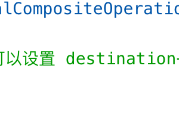

## 实现图片容器的方法：

1. css image-mask属性

2. canvas globalCompositeOperation API

> 它接收多个值，可以设置 destination-in 实现 css mask 同样的效果

## psd解析方案

| 解析库 | 活跃度 | 解析数据 | Star | 包体积 |
| --- | --- | --- | --- | --- |
| [psd.js](https://github.com/meltingice/psd.js) | 极低 | 部分重要数据 | 2600 | 400Kb+ |
| [ag-psd](https://github.com/Agamnentzar/ag-psd) | 较高 | 校多 | 363 | ~200Kb |
| [@webtoon/psd](https://github.com/webtoon/psd) | 较高 | 部分重要数据 | 921 | ~100Kb |

以上各个库颜色模式基本只支持 rgba，这也没什么太大问题。

psd.js 缺陷：深度和图像模式有限，对于复杂的 PSD 解析成功率较低，容易出现假死。不支持 ES6 引入方式，只能通过全局引入后在主线程调用。

psd.js 是基于 [ psd.rb ](https://github.com/layervault/psd.rb) 做解析的，而这个库已经很久不更新了，最后一次提交记录为 bug fix（4年前），最后一个发行版代码也停留在了 2015 年，所以这种情况下 psd.js 这两年没有更新也就可以理解了。

> 打开 psd.js 的开源仓库我们会发现，其作者使用了一个冷门的开发语言： CoffeeScript，它旨在提供更简洁的语法，最终编译成 JavaScript，而其语法则是借鉴了 Python 和 Ruby，这不就巧了吗？刚好 psd.rb 就是使用 Ruby 开发的库。
> 所以我大胆猜测，psd.js 的作者极大可能本身比较熟悉 Ruby 语言，所以“基于” psd.rb（注意并不是“依赖”）使用 CoffeeScript 将代码“转译”为 JavaScript 语言的库，以此诞生了 psd.js，这也就是为什么作者会说：The eventual goal is full feature parity with PSD.rb.（最终目标是与 PSD.rb 具有相同的全部功能）。

结论：都有局限性，目前来看后来的两个库都在持续活跃，且是纯正的前端语言编写（TypeScript），而 psd.js 作为前几年流行的解析库，现在基本判处死刑了，感觉不会再有更新，可以直接放弃使用。

## 字体抽取

fontmin

## web worker

