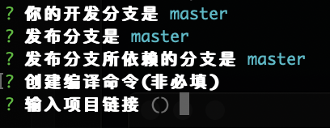
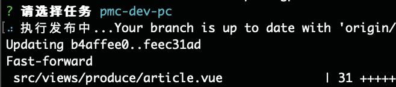
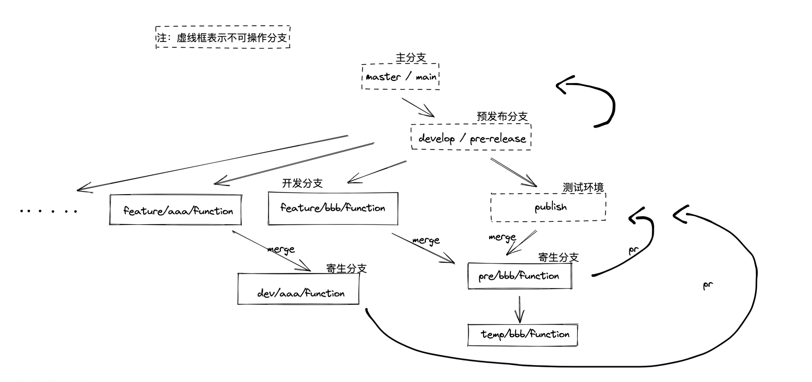

<!--
 * @Author: ShawnPhang
 * @LastEditors: ShawnPhang
 * @Description: 
 * @Date: 2021-07-22 16:48:12
 * @LastEditTime: 2021-12-09 14:53:22
 * @site: book.palxp.com / blog.palxp.com
-->

### gp-cli

一个便捷提交部署代码的脚手架工具，意为 Git Performer (GIT 执行者)。

以任务模式驱动，可在项目下创建发布任务，然后通过选择不同的发布任务来自动执行git合并部署等提交，并且自动打开PR链接(目前仅支持Github和Gitlab)，使得不同项目或分支的提交操作变得简单明了。

beta阶段，暂无发布。

- [x] feat: 冲突监测逻辑(支持任务重启)
- [x] feat: 判断任务执行风险(如果选择了不是当前分支的任务)，阻止并协助跳转
- [x] feat: 未提交代码时不进行操作

### 使用示例

通过命令创建任务: 
```
gp-cli create <task name>
```

此时会自动根据当前本地的分支，进行交互操作。



通过命令查看已创建的任务: 

```
gp-cli list
```

选择并执行: 



之后会自动打开PR比较界面，点击创建合并执行后续的操作。

### 研发思路

常见的公司内部代码提交流程:


基于此类PR流程的代码提交，可以总结出三个变量，分别是：

1. 代码开发分支
2. 发布分支
3. 依赖分支

我们在开发分支上编写feature，提交代码后切换到发布分支，这个发布分支是基于依赖分支拉出来的寄生分支，也可称依赖分支为“目标分支”，最后代码会提交至此目标分支，进行部署操作(自动化部署不在此工具影响范围内)，在发布分支会拉取目标分支的最新代码与开发分支合并，如产生冲突，则手动解决冲突后再提交。

本工具既是把上述流程自动化，以任务的模式来执行。