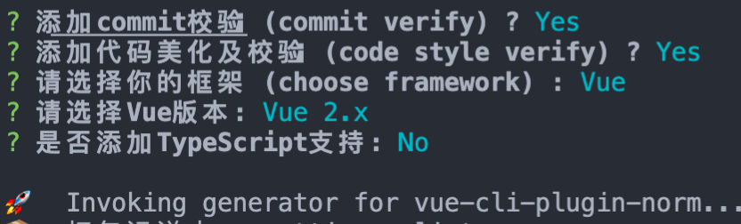
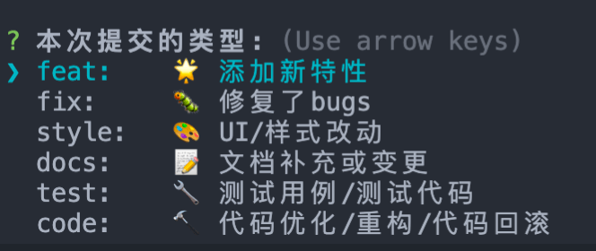

<!--
 * @Author: ShawnPhang
 * @LastEditors: ShawnPhang
 * @Description: 
 * @Date: 2021-07-22 17:50:16
 * @LastEditTime: 2022-07-28 22:32:02
 * @site: book.palxp.com / blog.palxp.com
-->

### vue-cli-plugin-norm

一个快速为项目创建代码美化与校验，代码提交规范的工具。

```
vue add vue-cli-plugin-norm
```

[Github 开源地址](https://github.com/palxiao/vue-cli-plugin-norm)

 

[项目npm地址](https://www.npmjs.com/package/vue-cli-plugin-norm)

相关文章:

[前端团队规范探索：自动格式化、代码校验、提交规范](https://juejin.cn/post/6977382480055631909)

安装预览: 



提交功能预览: 

